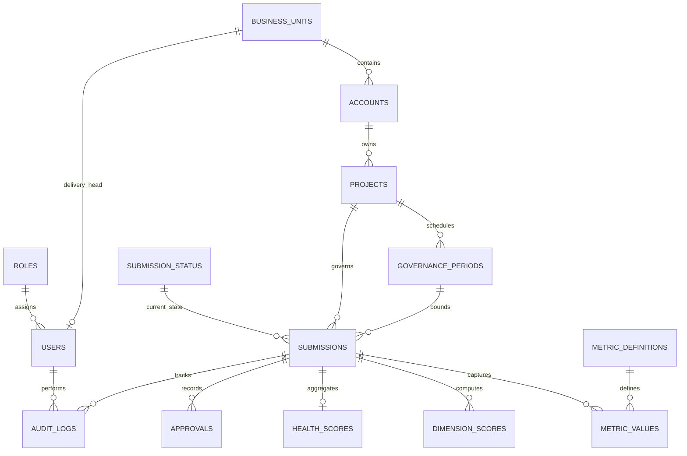

# DeliveryPulse AI — Backend Architecture Design

**Version:** 1.0  
**Status:** Draft  
**Aligned with:** `PRODUCT_SPECIFICATION.md` v1.1  
**Stack:** FastAPI (Python) · PostgreSQL · React (frontend, out of scope here)  
**Last updated:** 2026-05-19  

---

## Document control

| Field | Value |
|-------|-------|
| Document type | Backend architecture — schema, relationships, dates, audit, API contract |
| Out of scope | Implementation code, React UI, dashboards, DDL migrations |

---

## Architecture overview

```
┌──────────────┐     ┌─────────────────────────────────────────────────────────┐
│   React UI   │────▶│ FastAPI (DeliveryPulse API)                              │
│  (external)  │     │  Auth · Projects · Submissions · Excel · Approvals · Health │
└──────────────┘     └────────────┬────────────────────────────────────────────────┘
                                  │
                    ┌─────────────┼─────────────┐
                    ▼             ▼             ▼
              PostgreSQL    Object store    (future)
              (normalized   (Excel files,   AI / integration
               schema)       import blobs)   workers
```

**Design principles**

| Principle | Application |
|-----------|-------------|
| Normalization | Master data, metrics, scores, and audit separated |
| Single submission pipeline | Manual and Excel paths write to the same `metric_values` structure |
| Immutability at lock | `LOCKED` submissions trigger snapshot; live rows become read-only |
| UTC storage | All `TIMESTAMPTZ` in PostgreSQL; presentation timezone in frontend |
| Extensibility | Nullable AI/integration columns; `audit_logs` polymorphic by entity |
| Soft delete | Master/organizational tables only; governance facts are never soft-deleted |

---

# PART 1 — DATABASE DESIGN

## 1.1 Conventions (all tables)

| Convention | Rule |
|------------|------|
| Primary keys | `UUID` via `gen_random_uuid()` unless noted |
| Timestamps | `TIMESTAMPTZ NOT NULL` — stored in UTC |
| `created_at` | Set on insert; never updated |
| `updated_at` | Set on insert; updated on every row change |
| Soft delete | `deleted_at TIMESTAMPTZ NULL` where applicable; active rows have `deleted_at IS NULL` |
| Naming | `snake_case` tables and columns |
| Enums | PostgreSQL `ENUM` or lookup tables; lifecycle uses lookup `submission_status` |
| Money | `NUMERIC(18,2)` |
| Percentages / scores | `NUMERIC(5,2)` with check constraints per product spec |

**Partial unique indexes** (where soft delete applies):

```text
UNIQUE (...) WHERE deleted_at IS NULL
```

---

## 1.2 Table: `roles`

### Purpose

Canonical role catalog for RBAC: PM, Delivery Head, Platform Admin.

### Columns

| Column | Datatype | Constraints | Notes |
|--------|----------|-------------|-------|
| `id` | `UUID` | PK | |
| `code` | `VARCHAR(50)` | NOT NULL, UNIQUE | `PM`, `DELIVERY_HEAD`, `PLATFORM_ADMIN` |
| `name` | `VARCHAR(100)` | NOT NULL | Display label |
| `description` | `TEXT` | NULL | |
| `is_system` | `BOOLEAN` | NOT NULL, DEFAULT true | Prevents delete of built-in roles |
| `created_at` | `TIMESTAMPTZ` | NOT NULL | |
| `updated_at` | `TIMESTAMPTZ` | NOT NULL | |
| `deleted_at` | `TIMESTAMPTZ` | NULL | Soft delete (discouraged for system roles) |

### Primary key

`id`

### Foreign keys

None (root reference table)

### Indexes

| Index | Columns | Purpose |
|-------|---------|---------|
| `pk_roles` | `id` | Primary key |
| `uq_roles_code_active` | `code` WHERE `deleted_at IS NULL` | Active code uniqueness |
| `idx_roles_deleted_at` | `deleted_at` | Admin filtering |

### Soft delete strategy

Soft delete allowed for custom roles only (`is_system = false`). System roles cannot be soft-deleted.

### Relationships

- One role → many `users` (via `users.role_id` primary role)
- One role → many `user_role_scopes` (supporting table, §1.17) for scoped assignments

---

## 1.3 Table: `users`

### Purpose

Authenticated principals (PM, Delivery Head, Platform Admin).

### Columns

| Column | Datatype | Constraints | Notes |
|--------|----------|-------------|-------|
| `id` | `UUID` | PK | |
| `email` | `VARCHAR(255)` | NOT NULL | Login identifier |
| `password_hash` | `VARCHAR(255)` | NOT NULL | Bcrypt/Argon2 (app layer) |
| `full_name` | `VARCHAR(200)` | NOT NULL | |
| `role_id` | `UUID` | NOT NULL, FK → `roles.id` | Primary role |
| `business_unit_id` | `UUID` | NULL, FK → `business_units.id` | DH / PM org anchor |
| `is_active` | `BOOLEAN` | NOT NULL, DEFAULT true | |
| `last_login_at` | `TIMESTAMPTZ` | NULL | |
| `created_at` | `TIMESTAMPTZ` | NOT NULL | |
| `updated_at` | `TIMESTAMPTZ` | NOT NULL | |
| `deleted_at` | `TIMESTAMPTZ` | NULL | Soft delete |

### Primary key

`id`

### Foreign keys

| FK | References |
|----|------------|
| `role_id` | `roles(id)` |
| `business_unit_id` | `business_units(id)` |

### Indexes

| Index | Columns | Purpose |
|-------|---------|---------|
| `pk_users` | `id` | PK |
| `uq_users_email_active` | `email` WHERE `deleted_at IS NULL` | Unique active email |
| `idx_users_role_id` | `role_id` | RBAC queries |
| `idx_users_business_unit_id` | `business_unit_id` | Portfolio scoping |
| `idx_users_is_active` | `is_active` | Auth provisioning |

### Soft delete strategy

`deleted_at` set on deprovision; user cannot authenticate when `deleted_at IS NOT NULL` or `is_active = false`.

### Relationships

- Belongs to one `roles`
- Optional belongs to one `business_units`
- Creates/updates `submissions`, `metric_values`, `approvals`, `audit_logs`
- Assigned to projects via `project_assignments` (§1.17)

---

## 1.4 Table: `business_units`

### Purpose

Organizational unit for portfolio grouping and Delivery Head scope (replaces informal “portfolio” from product spec).

### Columns

| Column | Datatype | Constraints | Notes |
|--------|----------|-------------|-------|
| `id` | `UUID` | PK | |
| `code` | `VARCHAR(50)` | NOT NULL | Short code |
| `name` | `VARCHAR(200)` | NOT NULL | |
| `delivery_head_user_id` | `UUID` | NULL, FK → `users.id` | Portfolio owner |
| `governance_frequency` | `VARCHAR(20)` | NOT NULL, DEFAULT `MONTHLY` | `WEEKLY`, `MONTHLY` |
| `lock_offset_days` | `INTEGER` | NOT NULL, DEFAULT 5 | Days after `period_end` before auto-lock |
| `created_at` | `TIMESTAMPTZ` | NOT NULL | |
| `updated_at` | `TIMESTAMPTZ` | NOT NULL | |
| `deleted_at` | `TIMESTAMPTZ` | NULL | Soft delete |

### Primary key

`id`

### Foreign keys

| FK | References |
|----|------------|
| `delivery_head_user_id` | `users(id)` |

### Indexes

| Index | Columns | Purpose |
|-------|---------|---------|
| `pk_business_units` | `id` | PK |
| `uq_business_units_code_active` | `code` WHERE `deleted_at IS NULL` | |
| `idx_business_units_delivery_head` | `delivery_head_user_id` | DH queue |

### Soft delete strategy

Soft delete cascades logically to accounts/projects only by policy (apps block new submissions on deleted BU).

### Relationships

- One BU → many `accounts`
- One BU → many `users` (optional anchor)
- Configured by Platform Admin

---

## 1.5 Table: `accounts`

### Purpose

Customer or internal account entity owning one or more governed projects.

### Columns

| Column | Datatype | Constraints | Notes |
|--------|----------|-------------|-------|
| `id` | `UUID` | PK | |
| `business_unit_id` | `UUID` | NOT NULL, FK → `business_units.id` | |
| `code` | `VARCHAR(50)` | NOT NULL | Unique within BU |
| `name` | `VARCHAR(200)` | NOT NULL | |
| `currency_code` | `CHAR(3)` | NOT NULL, DEFAULT `USD` | ISO 4217 |
| `is_active` | `BOOLEAN` | NOT NULL, DEFAULT true | |
| `created_at` | `TIMESTAMPTZ` | NOT NULL | |
| `updated_at` | `TIMESTAMPTZ` | NOT NULL | |
| `deleted_at` | `TIMESTAMPTZ` | NULL | Soft delete |

### Primary key

`id`

### Foreign keys

| FK | References |
|----|------------|
| `business_unit_id` | `business_units(id)` |

### Indexes

| Index | Columns | Purpose |
|-------|---------|---------|
| `pk_accounts` | `id` | PK |
| `uq_accounts_bu_code_active` | `business_unit_id`, `code` WHERE `deleted_at IS NULL` | |
| `idx_accounts_business_unit_id` | `business_unit_id` | Hierarchy traversal |

### Soft delete strategy

Standard `deleted_at`; historical submissions retain `account_id` reference.

### Relationships

- Belongs to one `business_units`
- One account → many `projects`

---

## 1.6 Table: `projects`

### Purpose

Governed delivery unit — anchor for governance periods, submissions, and metrics.

### Columns

| Column | Datatype | Constraints | Notes |
|--------|----------|-------------|-------|
| `id` | `UUID` | PK | |
| `account_id` | `UUID` | NOT NULL, FK → `accounts.id` | |
| `code` | `VARCHAR(50)` | NOT NULL | Unique within account |
| `name` | `VARCHAR(200)` | NOT NULL | |
| `description` | `TEXT` | NULL | |
| `currency_code` | `CHAR(3)` | NOT NULL | Inherited default from account; overridable |
| `status` | `VARCHAR(20)` | NOT NULL, DEFAULT `ACTIVE` | `ACTIVE`, `ON_HOLD`, `CLOSED` |
| `primary_pm_user_id` | `UUID` | NULL, FK → `users.id` | Default PM |
| `reporting_frequency` | `VARCHAR(20)` | NULL | Overrides BU default if set |
| `metadata` | `JSONB` | NULL | Future tags, integration IDs |
| `created_at` | `TIMESTAMPTZ` | NOT NULL | |
| `updated_at` | `TIMESTAMPTZ` | NOT NULL | |
| `deleted_at` | `TIMESTAMPTZ` | NULL | Soft delete |

### Primary key

`id`

### Foreign keys

| FK | References |
|----|------------|
| `account_id` | `accounts(id)` |
| `primary_pm_user_id` | `users(id)` |

### Indexes

| Index | Columns | Purpose |
|-------|---------|---------|
| `pk_projects` | `id` | PK |
| `uq_projects_account_code_active` | `account_id`, `code` WHERE `deleted_at IS NULL` | |
| `idx_projects_account_id` | `account_id` | |
| `idx_projects_primary_pm` | `primary_pm_user_id` | PM project list |
| `idx_projects_status` | `status` | Filtering |

### Soft delete strategy

Soft delete; closed projects retain full governance history.

### Relationships

- Belongs to one `accounts` → `business_units`
- One project → many `governance_periods`
- One project → many `submissions` (via periods)
- PM assignment via `primary_pm_user_id` and `project_assignments`

---

## 1.7 Table: `governance_periods`

### Purpose

Time window for official metric snapshot (`period_start`, `period_end` per product spec §3.7).

### Columns

| Column | Datatype | Constraints | Notes |
|--------|----------|-------------|-------|
| `id` | `UUID` | PK | |
| `project_id` | `UUID` | NOT NULL, FK → `projects.id` | |
| `period_label` | `VARCHAR(50)` | NOT NULL | e.g. `2026-05` |
| `period_start` | `DATE` | NOT NULL | Governance period start (date-only boundary) |
| `period_end` | `DATE` | NOT NULL | Governance period end; must be ≥ `period_start` |
| `period_status` | `VARCHAR(20)` | NOT NULL, DEFAULT `OPEN` | `OPEN`, `CLOSED` |
| `created_at` | `TIMESTAMPTZ` | NOT NULL | |
| `updated_at` | `TIMESTAMPTZ` | NOT NULL | |

### Primary key

`id`

### Foreign keys

| FK | References |
|----|------------|
| `project_id` | `projects(id)` |

### Indexes

| Index | Columns | Purpose |
|-------|---------|---------|
| `pk_governance_periods` | `id` | PK |
| `uq_governance_periods_project_label` | `project_id`, `period_label` | One label per project |
| `idx_governance_periods_project_dates` | `project_id`, `period_start`, `period_end` | Period lookup |
| `idx_governance_periods_period_end` | `period_end` | Lock scheduler job |

### Soft delete strategy

**No soft delete.** Periods are permanent audit anchors. Erroneous periods are voided via `period_status = 'VOID'` (admin-only, audited).

### Relationships

- Belongs to one `projects`
- One period → one active `submissions` row (per version chain; see §1.8)
- Drives `period_start` / `period_end` on submission snapshots

---

## 1.8 Table: `submission_status`

### Purpose

Lookup / reference table for submission lifecycle states (product spec §3.2).

### Columns

| Column | Datatype | Constraints | Notes |
|--------|----------|-------------|-------|
| `id` | `SMALLINT` | PK | Stable integer IDs for FK performance |
| `code` | `VARCHAR(30)` | NOT NULL, UNIQUE | `DRAFT`, `SUBMITTED`, `UNDER_REVIEW`, `APPROVED`, `REJECTED`, `REOPENED`, `LOCKED` |
| `name` | `VARCHAR(100)` | NOT NULL | Display |
| `allows_editing` | `BOOLEAN` | NOT NULL | True only for `DRAFT` |
| `is_terminal` | `BOOLEAN` | NOT NULL | True for `LOCKED` |
| `sort_order` | `SMALLINT` | NOT NULL | UI ordering |
| `created_at` | `TIMESTAMPTZ` | NOT NULL | |
| `updated_at` | `TIMESTAMPTZ` | NOT NULL | |

### Seed data

| id | code | allows_editing | is_terminal |
|----|------|----------------|-------------|
| 1 | DRAFT | true | false |
| 2 | SUBMITTED | false | false |
| 3 | UNDER_REVIEW | false | false |
| 4 | APPROVED | false | false |
| 5 | REJECTED | false | false |
| 6 | REOPENED | false | false |
| 7 | LOCKED | false | true |

### Primary key

`id`

### Foreign keys

None

### Indexes

| Index | Columns |
|-------|---------|
| `pk_submission_status` | `id` |
| `uq_submission_status_code` | `code` |

### Soft delete strategy

**No soft delete** — reference data.

### Relationships

- Referenced by `submissions.current_status_id`
- Referenced by `submission_status_history` (§1.17)

---

## 1.9 Table: `submissions`

### Purpose

Governance submission for a project period — lifecycle, dates, versioning, Excel/manual convergence, reopen support.

### Columns

| Column | Datatype | Constraints | Notes |
|--------|----------|-------------|-------|
| `id` | `UUID` | PK | |
| `governance_period_id` | `UUID` | NOT NULL, FK → `governance_periods.id` | |
| `project_id` | `UUID` | NOT NULL, FK → `projects.id` | Denormalized for query performance |
| `version` | `INTEGER` | NOT NULL, DEFAULT 1 | Increments on reopen |
| `current_status_id` | `SMALLINT` | NOT NULL, FK → `submission_status.id` | |
| `submitted_by_user_id` | `UUID` | NULL, FK → `users.id` | PM who submitted |
| `data_entry_mode` | `VARCHAR(20)` | NULL | `MANUAL`, `EXCEL`, `MIXED` — set at submit |
| `submission_date` | `TIMESTAMPTZ` | NULL | Set on transition to `SUBMITTED` |
| `approval_date` | `TIMESTAMPTZ` | NULL | Set on transition to `APPROVED` |
| `rag_band` | `VARCHAR(10)` | NULL | `GREEN`, `AMBER`, `RED` — overall at last compute |
| `rag_start_date` | `DATE` | NULL | Date current RAG became effective |
| `locked_at` | `TIMESTAMPTZ` | NULL | Set on `LOCKED` |
| `is_current` | `BOOLEAN` | NOT NULL, DEFAULT true | False when superseded by reopen |
| `parent_submission_id` | `UUID` | NULL, FK → `submissions.id` | Prior version in reopen chain |
| `reopen_reason` | `TEXT` | NULL | Required when entering `REOPENED` |
| `snapshot_id` | `UUID` | NULL, FK → `submission_snapshots.id` | Populated when locked |
| `excel_import_batch_id` | `UUID` | NULL, FK → `excel_import_batches.id` | Last applied import |
| `pm_exception_comment` | `TEXT` | NULL | Required if any metric red at submit |
| `created_at` | `TIMESTAMPTZ` | NOT NULL | |
| `updated_at` | `TIMESTAMPTZ` | NOT NULL | |

### Primary key

`id`

### Foreign keys

| FK | References |
|----|------------|
| `governance_period_id` | `governance_periods(id)` |
| `project_id` | `projects(id)` |
| `current_status_id` | `submission_status(id)` |
| `submitted_by_user_id` | `users(id)` |
| `parent_submission_id` | `submissions(id)` |
| `snapshot_id` | `submission_snapshots(id)` |
| `excel_import_batch_id` | `excel_import_batches(id)` |

### Indexes

| Index | Columns | Purpose |
|-------|---------|---------|
| `pk_submissions` | `id` | PK |
| `uq_submissions_period_version` | `governance_period_id`, `version` | Version chain |
| `uq_submissions_period_current` | `governance_period_id` WHERE `is_current = true` | One active submission per period |
| `idx_submissions_project_id` | `project_id` | Project history |
| `idx_submissions_status` | `current_status_id` | DH review queue |
| `idx_submissions_submission_date` | `submission_date` | Aging |
| `idx_submissions_rag_band` | `rag_band`, `rag_start_date` | Portfolio RAG filters |
| `idx_submissions_locked_at` | `locked_at` | Compliance queries |

### Soft delete strategy

**No soft delete.** Submissions are permanent records. Invalid drafts may be abandoned in `DRAFT` without delete (admin archive flag in `metadata` if needed).

### Relationships

- Belongs to one `governance_periods`, one `projects`
- Has many `metric_values`, `dimension_scores`, one current `health_scores`
- Has many `approvals`
- Has many `audit_logs` (polymorphic)
- Supports reopen via `parent_submission_id` + `version` increment

### Lifecycle storage

Status transitions are recorded in `submission_status_history` (§1.17) and `audit_logs`.

---

## 1.10 Table: `metric_definitions`

### Purpose

Canonical catalog of governance metrics (product spec §4) — drives validation, scoring, and Excel template columns.

### Columns

| Column | Datatype | Constraints | Notes |
|--------|----------|-------------|-------|
| `id` | `UUID` | PK | |
| `code` | `VARCHAR(80)` | NOT NULL, UNIQUE | e.g. `planned_progress_percent` |
| `name` | `VARCHAR(200)` | NOT NULL | |
| `dimension_code` | `VARCHAR(30)` | NOT NULL | `SCHEDULE`, `QUALITY`, `SCOPE`, `FINANCE`, `PEOPLE` |
| `datatype` | `VARCHAR(20)` | NOT NULL | `DECIMAL`, `INTEGER`, `CURRENCY` |
| `unit` | `VARCHAR(30)` | NULL | `PERCENT`, `COUNT`, `DAYS`, `CURRENCY` |
| `is_required` | `BOOLEAN` | NOT NULL, DEFAULT true | |
| `min_value` | `NUMERIC(18,4)` | NULL | Validation |
| `max_value` | `NUMERIC(18,4)` | NULL | Validation |
| `weight_in_dimension` | `NUMERIC(5,4)` | NULL | Scoring weight |
| `validation_rules` | `JSONB` | NULL | Cross-field rules, comment requirements |
| `formula_expression` | `TEXT` | NULL | Backend scoring reference (documentation + engine) |
| `excel_column_key` | `VARCHAR(80)` | NULL | Template mapping |
| `display_order` | `SMALLINT` | NOT NULL | Form / template order |
| `effective_from` | `DATE` | NOT NULL | Policy versioning |
| `effective_to` | `DATE` | NULL | NULL = current |
| `created_at` | `TIMESTAMPTZ` | NOT NULL | |
| `updated_at` | `TIMESTAMPTZ` | NOT NULL | |

### Primary key

`id`

### Foreign keys

None

### Indexes

| Index | Columns | Purpose |
|-------|---------|---------|
| `pk_metric_definitions` | `id` | PK |
| `uq_metric_definitions_code` | `code` | |
| `idx_metric_definitions_dimension` | `dimension_code`, `display_order` | |
| `idx_metric_definitions_effective` | `effective_from`, `effective_to` | Policy as-of queries |

### Soft delete strategy

**No soft delete.** Supersede via `effective_to` date (Platform Admin policy change).

### Relationships

- One definition → many `metric_values`
- Referenced by Excel template generator

### Seed metrics (v1)

| code | dimension_code | datatype |
|------|----------------|----------|
| `planned_progress_percent` | SCHEDULE | DECIMAL |
| `actual_progress_percent` | SCHEDULE | DECIMAL |
| `dependency_delay_count` | SCHEDULE | INTEGER |
| `critical_defects` | QUALITY | INTEGER |
| `test_pass_rate` | QUALITY | DECIMAL |
| `prod_incidents` | QUALITY | INTEGER |
| `scope_change_requests` | SCOPE | INTEGER |
| `requirement_stability_percent` | SCOPE | DECIMAL |
| `budget_used` | FINANCE | CURRENCY |
| `planned_budget` | FINANCE | CURRENCY |
| `billing_delay_days` | FINANCE | INTEGER |
| `resource_availability` | PEOPLE | DECIMAL |
| `team_attrition` | PEOPLE | INTEGER |

---

## 1.11 Table: `metric_values`

### Purpose

Typed metric input per submission — shared structure for manual form, Excel import preview, and locked snapshots.

### Columns

| Column | Datatype | Constraints | Notes |
|--------|----------|-------------|-------|
| `id` | `UUID` | PK | |
| `submission_id` | `UUID` | NOT NULL, FK → `submissions.id` | |
| `metric_definition_id` | `UUID` | NOT NULL, FK → `metric_definitions.id` | |
| `value_numeric` | `NUMERIC(18,4)` | NULL | Primary storage for DECIMAL/INTEGER/CURRENCY |
| `value_text` | `TEXT` | NULL | PM comments per metric |
| `source` | `VARCHAR(20)` | NOT NULL, DEFAULT `MANUAL` | `MANUAL`, `EXCEL_IMPORT`, `INTEGRATION`, `AI_SUGGESTED` |
| `row_state` | `VARCHAR(20)` | NOT NULL, DEFAULT `COMMITTED` | `STAGING` (preview), `COMMITTED` (draft/submitted) |
| `excel_import_batch_id` | `UUID` | NULL, FK → `excel_import_batches.id` | |
| `entered_by_user_id` | `UUID` | NOT NULL, FK → `users.id` | |
| `is_valid` | `BOOLEAN` | NULL | Result of last validation pass |
| `validation_errors` | `JSONB` | NULL | Field errors from parser/validator |
| `ai_confidence` | `NUMERIC(5,4)` | NULL | Future AI extensions |
| `ai_suggested_value` | `NUMERIC(18,4)` | NULL | Future AI extensions |
| `created_at` | `TIMESTAMPTZ` | NOT NULL | |
| `updated_at` | `TIMESTAMPTZ` | NOT NULL | |

### Primary key

`id`

### Foreign keys

| FK | References |
|----|------------|
| `submission_id` | `submissions(id)` ON DELETE RESTRICT |
| `metric_definition_id` | `metric_definitions(id)` |
| `entered_by_user_id` | `users(id)` |
| `excel_import_batch_id` | `excel_import_batches(id)` |

### Indexes

| Index | Columns | Purpose |
|-------|---------|---------|
| `pk_metric_values` | `id` | PK |
| `uq_metric_values_submission_metric_state` | `submission_id`, `metric_definition_id`, `row_state` WHERE `row_state = 'COMMITTED'` | One committed value per metric |
| `idx_metric_values_submission` | `submission_id` | Load form |
| `idx_metric_values_staging_batch` | `excel_import_batch_id` WHERE `row_state = 'STAGING'` | Preview screen |
| `idx_metric_values_source` | `source` | Lineage |

### Soft delete strategy

**No soft delete.** Updates allowed only when submission `allows_editing = true`. On `LOCKED`, values are copied to `submission_snapshots.snapshot_payload` and rows are read-only.

### Relationships

- Belongs to one `submissions`, one `metric_definitions`
- Excel flow: parser writes `row_state = STAGING`; PM confirm merges to `COMMITTED`

### Excel / manual convergence

| Step | `row_state` | `source` |
|------|-------------|----------|
| Parse upload | `STAGING` | `EXCEL_IMPORT` |
| PM edits preview | `STAGING` | `EXCEL_IMPORT` |
| Apply to draft | `COMMITTED` (upsert) | `EXCEL_IMPORT` or `MIXED` |
| Manual form save | `COMMITTED` | `MANUAL` |
| Submit | `COMMITTED` (validated) | unchanged |

---

## 1.12 Table: `dimension_scores`

### Purpose

Computed dimension-level scores (0–100) and RAG band per submission compute cycle.

### Columns

| Column | Datatype | Constraints | Notes |
|--------|----------|-------------|-------|
| `id` | `UUID` | PK | |
| `submission_id` | `UUID` | NOT NULL, FK → `submissions.id` | |
| `dimension_code` | `VARCHAR(30)` | NOT NULL | Five dimensions |
| `score` | `NUMERIC(5,2)` | NOT NULL | 0.00–100.00 |
| `band` | `VARCHAR(10)` | NOT NULL | `GREEN`, `AMBER`, `RED` |
| `compute_version` | `INTEGER` | NOT NULL, DEFAULT 1 | Recompute on resubmit |
| `computed_at` | `TIMESTAMPTZ` | NOT NULL | |
| `formula_snapshot` | `JSONB` | NULL | Inputs used (audit / AI) |
| `created_at` | `TIMESTAMPTZ` | NOT NULL | |
| `updated_at` | `TIMESTAMPTZ` | NOT NULL | |

### Primary key

`id`

### Foreign keys

| FK | References |
|----|------------|
| `submission_id` | `submissions(id)` |

### Indexes

| Index | Columns | Purpose |
|-------|---------|---------|
| `pk_dimension_scores` | `id` | PK |
| `uq_dimension_scores_submission_dimension_version` | `submission_id`, `dimension_code`, `compute_version` | |
| `idx_dimension_scores_submission` | `submission_id` | |
| `idx_dimension_scores_band` | `band` | Portfolio filters |

### Soft delete strategy

**No soft delete.** New `compute_version` on each scoring run after submit/resubmit.

### Relationships

- Many per `submissions` (5 dimensions × versions)
- Feeds `health_scores` computation

---

## 1.13 Table: `health_scores`

### Purpose

Overall project health score for a submission compute cycle (product spec §5).

### Columns

| Column | Datatype | Constraints | Notes |
|--------|----------|-------------|-------|
| `id` | `UUID` | PK | |
| `submission_id` | `UUID` | NOT NULL, FK → `submissions.id` | |
| `raw_score` | `NUMERIC(5,2)` | NOT NULL | Weighted dimension average |
| `capped_score` | `NUMERIC(5,2)` | NOT NULL | After red-dimension cap (≤79) |
| `band` | `VARCHAR(10)` | NOT NULL | `GREEN`, `AMBER`, `RED` |
| `dimension_cap_applied` | `BOOLEAN` | NOT NULL, DEFAULT false | §5.4 rule |
| `dh_exception_acknowledged` | `BOOLEAN` | NOT NULL, DEFAULT false | Lifts cap when true |
| `compute_version` | `INTEGER` | NOT NULL, DEFAULT 1 | |
| `computed_at` | `TIMESTAMPTZ` | NOT NULL | |
| `ai_insight_summary` | `TEXT` | NULL | Future AI narrative |
| `created_at` | `TIMESTAMPTZ` | NOT NULL | |
| `updated_at` | `TIMESTAMPTZ` | NOT NULL | |

### Primary key

`id`

### Foreign keys

| FK | References |
|----|------------|
| `submission_id` | `submissions(id)` |

### Indexes

| Index | Columns | Purpose |
|-------|---------|---------|
| `pk_health_scores` | `id` | PK |
| `uq_health_scores_submission_version` | `submission_id`, `compute_version` | |
| `idx_health_scores_capped_score` | `capped_score` | DH queue sort |
| `idx_health_scores_band` | `band` | |

### Soft delete strategy

**No soft delete.**

### Relationships

- Belongs to one `submissions`
- `submissions.rag_band` / `rag_start_date` updated from latest `health_scores` when band changes

---

## 1.14 Table: `approvals`

### Purpose

Delivery Head approval / rejection decisions (product spec §3.4).

### Columns

| Column | Datatype | Constraints | Notes |
|--------|----------|-------------|-------|
| `id` | `UUID` | PK | |
| `submission_id` | `UUID` | NOT NULL, FK → `submissions.id` | |
| `decision` | `VARCHAR(20)` | NOT NULL | `APPROVE`, `REJECT`, `REOPEN` |
| `decided_by_user_id` | `UUID` | NOT NULL, FK → `users.id` | Delivery Head |
| `reason` | `TEXT` | NOT NULL for REJECT/REOPEN | |
| `decided_at` | `TIMESTAMPTZ` | NOT NULL | Maps to `approval_date` on approve |
| `escalation_type` | `VARCHAR(50)` | NULL | scope, funding, staffing, etc. |
| `created_at` | `TIMESTAMPTZ` | NOT NULL | |
| `updated_at` | `TIMESTAMPTZ` | NOT NULL | |

### Primary key

`id`

### Foreign keys

| FK | References |
|----|------------|
| `submission_id` | `submissions(id)` |
| `decided_by_user_id` | `users(id)` |

### Indexes

| Index | Columns | Purpose |
|-------|---------|---------|
| `pk_approvals` | `id` | PK |
| `idx_approvals_submission` | `submission_id` | History |
| `idx_approvals_decided_by` | `decided_by_user_id` | |
| `idx_approvals_decided_at` | `decided_at` | |

### Soft delete strategy

**No soft delete** — append-only decision log.

### Relationships

- Many approvals per submission (reject/reopen cycles)
- Approve sets `submissions.approval_date`

---

## 1.15 Table: `audit_logs`

### Purpose

Immutable audit trail for metric changes, status transitions, approvals, and admin actions (product spec §3.2, §3.7).

### Columns

| Column | Datatype | Constraints | Notes |
|--------|----------|-------------|-------|
| `id` | `UUID` | PK | |
| `entity_type` | `VARCHAR(50)` | NOT NULL | `submission`, `metric_value`, `project`, etc. |
| `entity_id` | `UUID` | NOT NULL | Polymorphic target |
| `action` | `VARCHAR(50)` | NOT NULL | `CREATE`, `UPDATE`, `STATUS_CHANGE`, `LOCK`, etc. |
| `field_name` | `VARCHAR(100)` | NULL | Column or logical field |
| `old_value` | `TEXT` | NULL | Serialized prior value |
| `new_value` | `TEXT` | NULL | Serialized new value |
| `changed_by_user_id` | `UUID` | NULL, FK → `users.id` | NULL = system job |
| `reason` | `TEXT` | NULL | Reopen, reject, admin |
| `metadata` | `JSONB` | NULL | IP, user-agent, batch id |
| `created_at` | `TIMESTAMPTZ` | NOT NULL | Event time (no `updated_at`) |

### Primary key

`id`

### Foreign keys

| FK | References |
|----|------------|
| `changed_by_user_id` | `users(id)` |

### Indexes

| Index | Columns | Purpose |
|-------|---------|---------|
| `pk_audit_logs` | `id` | PK |
| `idx_audit_logs_entity` | `entity_type`, `entity_id` | Entity history |
| `idx_audit_logs_changed_by` | `changed_by_user_id` | User activity |
| `idx_audit_logs_created_at` | `created_at` | Time-range queries |
| `idx_audit_logs_action` | `action` | |

### Soft delete strategy

**Never deleted or updated** — append-only.

### Relationships

- Polymorphic reference to any governed entity
- Complements `submission_status_history` for lifecycle

---

## 1.16 Supporting tables (required by workflows)

These tables are not in the mandatory list but are required by Excel preview, historical snapshots, and assignments.

### `excel_import_batches`

| Column | Datatype | Notes |
|--------|----------|-------|
| `id` | UUID PK | |
| `submission_id` | UUID FK | Target draft submission |
| `uploaded_by_user_id` | UUID FK | PM |
| `file_name` | VARCHAR(255) | |
| `file_storage_key` | VARCHAR(500) | Object store path |
| `parse_status` | VARCHAR(20) | `PENDING`, `PARSED`, `FAILED`, `APPLIED` |
| `parse_errors` | JSONB | |
| `row_count` | INTEGER | |
| `created_at`, `updated_at` | TIMESTAMPTZ | |

### `submission_snapshots`

| Column | Datatype | Notes |
|--------|----------|-------|
| `id` | UUID PK | |
| `submission_id` | UUID FK | Source submission at lock |
| `snapshot_version` | INTEGER | |
| `snapshot_payload` | JSONB | Frozen metrics, dimension_scores, health_scores |
| `locked_at` | TIMESTAMPTZ | |
| `locked_by` | VARCHAR(20) | `SYSTEM`, `ADMIN` |
| `created_at` | TIMESTAMPTZ | |

### `submission_status_history`

| Column | Datatype | Notes |
|--------|----------|-------|
| `id` | UUID PK | |
| `submission_id` | UUID FK | |
| `from_status_id` | SMALLINT FK | nullable on create |
| `to_status_id` | SMALLINT FK | |
| `changed_by_user_id` | UUID FK | |
| `reason` | TEXT | |
| `created_at` | TIMESTAMPTZ | |

### `project_assignments`

| Column | Datatype | Notes |
|--------|----------|-------|
| `id` | UUID PK | |
| `project_id` | UUID FK | |
| `user_id` | UUID FK | |
| `assignment_role` | VARCHAR(20) | `PM`, `DELEGATE_PM` |
| `created_at`, `updated_at`, `deleted_at` | TIMESTAMPTZ | Soft delete on assignment removal |

### `rag_band_history`

| Column | Datatype | Notes |
|--------|----------|-------|
| `id` | UUID PK | |
| `submission_id` | UUID FK | |
| `band` | VARCHAR(10) | |
| `rag_start_date` | DATE | |
| `rag_end_date` | DATE NULL | |
| `created_at` | TIMESTAMPTZ | |

---

## 1.17 Entity relationship summary (tables)

```
roles ─────────────┐
                   ├── users ──── project_assignments ─── projects
business_units ────┤                      │
      │            │                      │
      └── accounts ┴── projects ── governance_periods
                              │
                              └── submissions ──┬── metric_values ── metric_definitions
                                                ├── dimension_scores
                                                ├── health_scores
                                                ├── approvals
                                                ├── submission_status (FK)
                                                ├── submission_snapshots
                                                ├── excel_import_batches
                                                └── audit_logs (polymorphic)
```

---

# PART 2 — RELATIONSHIP DESIGN

## 2.1 Organizational hierarchy

```
Platform Admin (user.role = PLATFORM_ADMIN)
    │
    ├── configures → business_units
    │                      │
    │                      ├── accounts
    │                      │       │
    │                      │       └── projects
    │                      │
    │                      └── delivery_head_user_id → Delivery Head
    │
    └── assigns → users, projects, policies
```

## 2.2 Governance data flow (primary path)

```
Business Unit
    └── Account
            └── Project
                    └── Governance Period  (period_start, period_end)
                            └── Submission  (lifecycle, dates, version)
                                    ├── Metric Values  (manual + Excel → COMMITTED)
                                    ├── Dimension Scores  (×5, computed)
                                    └── Health Score  (overall, RAG, capped)
```

## 2.3 Role interaction on submissions

| Role | Entity touchpoints |
|------|-------------------|
| **PM** | Creates/edits `submissions` in `DRAFT`; writes `metric_values`; triggers Excel `STAGING` → `COMMITTED`; submits |
| **Delivery Head** | Reads portfolio via `business_units` → `projects`; `approvals`; transitions `UNDER_REVIEW` → `APPROVED`/`REJECTED`; `REOPENED` |
| **Platform Admin** | CRUD on `business_units`, `accounts`, `projects`, `users`, `metric_definitions`; audit via `audit_logs` |

## 2.4 Mermaid — entity relationship (core)



## 2.5 Submission lifecycle vs. data mutability

| Status | `metric_values` editable | Scores computed | Snapshot |
|--------|--------------------------|-----------------|----------|
| DRAFT | Yes (`COMMITTED` + `STAGING`) | Optional preview | No |
| SUBMITTED | No | Yes | No |
| UNDER_REVIEW | No | Yes | No |
| APPROVED | No | Yes | No |
| REJECTED | No (transitions to DRAFT) | Stale | No |
| REOPENED | No (transitions to DRAFT) | Stale | No |
| LOCKED | No | Frozen | Yes (`submission_snapshots`) |

## 2.6 Reopen and versioning

```
Submission v1 (LOCKED, snapshot S1)
    │
    └── REOPENED → new chain: Submission v2 (DRAFT, parent_submission_id = v1)
                        │
                        └── submit → ... → LOCKED (snapshot S2)
```

- `is_current = false` on superseded rows
- `uq_submissions_period_current` enforces one active submission per period
- Full metric/score history retained per version

## 2.7 Future AI extensions (schema readiness)

| Area | Extension |
|------|-----------|
| `metric_values` | `ai_suggested_value`, `ai_confidence`, `source = AI_SUGGESTED` |
| `health_scores` | `ai_insight_summary` |
| `audit_logs` | `changed_by_user_id` NULL + `metadata.agent_id` for AI actions |
| `dimension_scores.formula_snapshot` | Store feature vector for model replay |
| New table (future) | `ai_recommendations` FK → `submissions` |

---

# PART 3 — DATE STRATEGY

## 3.1 Storage rules

| Rule | Implementation |
|------|----------------|
| Database storage | All instants as `TIMESTAMPTZ` in UTC (`created_at`, `updated_at`, `submission_date`, `approval_date`, `locked_at`, `computed_at`) |
| Period boundaries | `period_start`, `period_end` as `DATE` (calendar boundaries in org timezone at creation, stored as date-only) |
| RAG effective date | `rag_start_date` as `DATE` on `submissions` + `rag_band_history` |
| API contract | ISO-8601 with `Z` suffix for instants; `YYYY-MM-DD` for dates |
| Frontend | Converts UTC → user locale for display; never sends local time without offset |

## 3.2 Field placement map

| Field | Primary table | Set when |
|-------|---------------|----------|
| `created_at` | All mutable tables | Insert |
| `updated_at` | All mutable tables | Insert / update |
| `period_start` | `governance_periods` | Period creation |
| `period_end` | `governance_periods` | Period creation |
| `submission_date` | `submissions` | Status → `SUBMITTED` |
| `approval_date` | `submissions` | Status → `APPROVED` |
| `rag_start_date` | `submissions`, `rag_band_history` | Overall `band` changes |
| `locked_at` | `submissions`, `submission_snapshots` | Status → `LOCKED` |

## 3.3 Aging calculations

Aging is computed at **read time** in the API/service layer using UTC `now()` unless a report-as-of date is supplied.

| Metric | Formula | Use |
|--------|---------|-----|
| **Days since submission** | `floor(now_utc - submission_date)` | DH review SLA (spec: 5 business days for amber portfolio) |
| **Days in current RAG** | `floor(today_utc_date - rag_start_date)` | Trend / escalation priority |
| **Days past period end** | `floor(today_utc_date - period_end)` | Overdue submission detection |
| **Days until auto-lock** | `lock_offset_days - days_since(period_end)` | Scheduler for `APPROVED` → `LOCKED` |
| **Days under review** | `floor(now_utc - first_under_review_at)` | From `submission_status_history` |
| **Billing / schedule aging** | Domain metrics (`billing_delay_days`) | Stored inputs, not system dates |

**Business-day SLA (amber review):**

- Use org calendar table (future) or approximate with `business_days_between(submission_date, now)` excluding weekends
- Stored in API response as `review_sla_days_elapsed` and `review_sla_breached: boolean`

**Report-as-of:**

- Query param `as_of=2026-05-19T00:00:00Z` for historical aging and trend charts without mutating stored dates

## 3.4 RAG history

When `health_scores.band` differs from `submissions.rag_band`:

1. Close prior `rag_band_history` row (`rag_end_date = yesterday`)
2. Insert new row with `rag_start_date = today_utc_date`
3. Update `submissions.rag_band` and `submissions.rag_start_date`

## 3.5 Auto-lock scheduler

Background job (FastAPI worker / cron):

```
FOR submissions WHERE status = APPROVED AND locked_at IS NULL:
  IF today_utc_date >= period_end + business_unit.lock_offset_days:
    transition to LOCKED
    create submission_snapshots
    set locked_at = now_utc
```

---

# PART 4 — AUDIT STRATEGY

## 4.1 Principles

| Principle | Rule |
|-----------|------|
| Append-only | `audit_logs` rows are never updated or deleted |
| Dual capture | Status transitions in `submission_status_history` **and** `audit_logs` |
| Human + system | `changed_by_user_id` NULL for scheduler/system |
| Reason required | `REJECTED`, `REOPENED`, metric override, break-glass admin |

## 4.2 Audited events

| Event | `entity_type` | `action` | `field_name` examples |
|-------|---------------|----------|------------------------|
| Metric edit | `metric_value` | `UPDATE` | `value_numeric`, `value_text` |
| Status change | `submission` | `STATUS_CHANGE` | `current_status_id` |
| Approval | `submission` | `APPROVE` / `REJECT` | `decision`, `reason` |
| Lock | `submission` | `LOCK` | `locked_at` |
| Excel parse | `excel_import_batch` | `PARSE` | `parse_status` |
| Project config | `project` | `UPDATE` | any changed column |

## 4.3 Record shape (required fields)

Every audit entry MUST capture:

| Field | Source |
|-------|--------|
| **old value** | `old_value` TEXT — JSON-serialized prior state |
| **new value** | `new_value` TEXT — JSON-serialized new state |
| **changed by** | `changed_by_user_id` → `users` |
| **reason** | `reason` TEXT — required on sensitive actions |
| **timestamp** | `created_at` TIMESTAMPTZ UTC |
| **entity affected** | `entity_type` + `entity_id` |

## 4.4 Value serialization

| Datatype | Serialization |
|----------|---------------|
| Numeric | Plain string decimal |
| Status | Status `code` (not only id) |
| JSON fields | Canonical JSON string |
| NULL | Empty string or literal `null` per API standard |

## 4.5 Correlation

| Mechanism | Purpose |
|-----------|---------|
| `metadata.correlation_id` | Tie batch Excel parse + multiple metric updates |
| `metadata.submission_id` | Cross-entity queries for one submit action |
| `submission_status_history` | Ordered lifecycle with timestamps |

## 4.6 Retention and compliance

| Policy | Default |
|--------|---------|
| Retention | Indefinite for governance submissions |
| PII in audit | Store user id only; no password/sensitive payloads |
| Query access | Platform Admin full; Delivery Head read for portfolio; PM read for own projects |

## 4.7 Break-glass (Platform Admin)

- All support edits logged with `action = BREAK_GLASS_UPDATE`
- Requires `reason` + second approver id in `metadata` (SoD per product spec §2.5)

---

# PART 5 — API CONTRACT DESIGN

## 5.1 Conventions

| Item | Standard |
|------|----------|
| Base path | `/api/v1` |
| Auth | Bearer JWT (issued by `POST /login`) |
| Content type | `application/json` unless file upload |
| Errors | `{ "detail": "...", "code": "VALIDATION_ERROR" }` |
| Pagination | `?page=1&page_size=50` on list endpoints (future) |
| Idempotency | `Idempotency-Key` header on `POST /submissions` submit action (future) |

## 5.2 Authentication

### `POST /api/v1/login`

| | |
|--|--|
| **Purpose** | Authenticate user; return access token |
| **Request body** | `{ "email": "string", "password": "string" }` |
| **Response 200** | `{ "access_token": "string", "token_type": "bearer", "expires_in": 3600, "user": { "id", "email", "full_name", "role_code" } }` |
| **Response 401** | Invalid credentials |
| **Roles** | Public |

---

## 5.3 Projects

### `GET /api/v1/projects`

| | |
|--|--|
| **Purpose** | List projects visible to caller (PM: assigned; DH: BU portfolio; Admin: all) |
| **Query params** | `business_unit_id`, `account_id`, `status`, `page`, `page_size` |
| **Response 200** | `{ "items": [ { "id", "code", "name", "account_id", "account_name", "business_unit_id", "status", "primary_pm_user_id", "currency_code" } ], "total": 0 }` |
| **Roles** | PM, Delivery Head, Platform Admin |

### `POST /api/v1/projects`

| | |
|--|--|
| **Purpose** | Create governed project |
| **Request body** | `{ "account_id", "code", "name", "description?", "currency_code?", "primary_pm_user_id?", "reporting_frequency?" }` |
| **Response 201** | Project object |
| **Response 400** | Validation / duplicate code |
| **Roles** | Platform Admin |

---

## 5.4 Submissions

### `POST /api/v1/submissions`

| | |
|--|--|
| **Purpose** | Multi-action endpoint via `action` field |
| **Request body (create draft)** | `{ "action": "CREATE_DRAFT", "project_id", "governance_period_id" }` |
| **Request body (save draft)** | `{ "action": "SAVE_DRAFT", "submission_id", "metrics": [ { "metric_code", "value_numeric", "value_text?" } ] }` |
| **Request body (submit)** | `{ "action": "SUBMIT", "submission_id", "pm_exception_comment?" }` |
| **Response 200/201** | `{ "submission": { ... }, "validation": { "is_valid", "errors": [] }, "dimension_scores": [], "health_score": {} }` |
| **Side effects** | SUBMIT: validate → compute scores → `SUBMITTED` → `UNDER_REVIEW` → audit |
| **Roles** | PM (assigned project) |

### `GET /api/v1/submissions/{id}`

| | |
|--|--|
| **Purpose** | Retrieve submission with metrics, scores, status, dates, aging fields |
| **Response 200** | `{ "submission": { "id", "project_id", "governance_period_id", "version", "status_code", "submission_date", "approval_date", "rag_band", "rag_start_date", "locked_at", "period_start", "period_end", "data_entry_mode", "allows_editing" }, "metrics": [ ... ], "dimension_scores": [ ... ], "health_score": { ... }, "aging": { "days_since_submission", "days_in_current_rag", "days_past_period_end", "review_sla_breached" }, "approvals": [ ... ] }` |
| **Response 404** | Not found or not authorized |
| **Roles** | PM (assigned), Delivery Head (portfolio), Platform Admin |

---

## 5.5 Excel

### `POST /api/v1/upload-template`

| | |
|--|--|
| **Purpose** | Upload filled Excel template for parsing (not final submission) |
| **Content type** | `multipart/form-data` |
| **Form fields** | `file` (xlsx), `submission_id` |
| **Response 200** | `{ "import_batch_id", "parse_status", "preview_metrics": [ { "metric_code", "value_numeric", "row_state": "STAGING", "validation_errors": [] } ], "parse_errors": [] }` |
| **Side effects** | Creates `excel_import_batches`; upserts `metric_values` with `row_state=STAGING` |
| **Roles** | PM |

### `POST /api/v1/parse-template`

| | |
|--|--|
| **Purpose** | Re-parse or validate existing upload; optional apply staged values to draft |
| **Request body** | `{ "import_batch_id", "submission_id", "action": "VALIDATE" \| "APPLY_TO_DRAFT" }` |
| **Response 200** | Same shape as upload preview; on `APPLY_TO_DRAFT`, merges `STAGING` → `COMMITTED` |
| **Rules** | Never transitions submission to `SUBMITTED` |
| **Roles** | PM |

**Note:** `GET` template download is a future endpoint (`GET /api/v1/templates/governance.xlsx`); not in v1 contract list.

---

## 5.6 Approvals

### `POST /api/v1/approve`

| | |
|--|--|
| **Purpose** | Delivery Head approves submission under review |
| **Request body** | `{ "submission_id", "reason?", "escalation_type?", "acknowledge_dimension_cap?": false }` |
| **Response 200** | `{ "submission": { "status_code": "APPROVED", "approval_date" }, "approval": { "id", "decision", "decided_at" } }` |
| **Side effects** | Status → `APPROVED`; `approval_date` set; `dh_exception_acknowledged` if cap acknowledged; audit |
| **Roles** | Delivery Head |

### `POST /api/v1/reject`

| | |
|--|--|
| **Purpose** | Delivery Head rejects submission for correction |
| **Request body** | `{ "submission_id", "reason" }` — `reason` required |
| **Response 200** | `{ "submission": { "status_code": "REJECTED" } }` then system → `DRAFT` |
| **Side effects** | `approvals` row; status history; audit |
| **Roles** | Delivery Head |

**Additional (documented, not in user list):** `POST /api/v1/reopen` for `REOPENED` → `DRAFT` with audited reason.

---

## 5.7 Health

### `GET /api/v1/health-score`

| | |
|--|--|
| **Purpose** | Retrieve computed health and dimension scores for a submission or project period |
| **Query params** | `submission_id` (preferred) OR (`project_id` + `governance_period_id`) |
| **Response 200** | `{ "submission_id", "compute_version", "raw_score", "capped_score", "band", "dimension_cap_applied", "dh_exception_acknowledged", "computed_at", "dimensions": [ { "dimension_code", "score", "band" } ] }` |
| **Response 404** | Submission not found or scores not yet computed |
| **Roles** | PM, Delivery Head, Platform Admin |

---

## 5.8 API map summary

| Method | Path | Role(s) |
|--------|------|---------|
| POST | `/api/v1/login` | Public |
| GET | `/api/v1/projects` | PM, DH, Admin |
| POST | `/api/v1/projects` | Admin |
| POST | `/api/v1/submissions` | PM |
| GET | `/api/v1/submissions/{id}` | PM, DH, Admin |
| POST | `/api/v1/upload-template` | PM |
| POST | `/api/v1/parse-template` | PM |
| POST | `/api/v1/approve` | DH |
| POST | `/api/v1/reject` | DH |
| GET | `/api/v1/health-score` | PM, DH, Admin |

## 5.9 Cross-cutting API behaviors

| Behavior | Applies to |
|----------|------------|
| UTC timestamps in responses | All endpoints returning dates |
| Validation gate | `POST /submissions` action `SUBMIT`, `POST /parse-template` action `APPLY_TO_DRAFT` |
| Edit lock | All metric writes when `allows_editing = false` → HTTP 409 |
| Audit | All mutating endpoints emit `audit_logs` |
| Historical read | `GET /submissions/{id}` includes `snapshot` payload when `LOCKED` |

---

## Appendix A — Alignment with product specification

| Product spec | Architecture |
|--------------|--------------|
| §3.2 Submission lifecycle | `submission_status` + `submissions` + `submission_status_history` |
| §3.3 Data entry modes | `metric_values.row_state`, `excel_import_batches` |
| §3.7 System date fields | Field placement §3.2; UTC rules §3.1 |
| §4 Metrics | `metric_definitions` + `metric_values` |
| §5 Health score | `dimension_scores` + `health_scores` |
| §5.4 Dimension cap | `capped_score`, `dh_exception_acknowledged` |
| §3.6 Excel never direct submit | Staging + single `POST /submissions` submit pipeline |

---

## Appendix B — Index and integrity checklist

| Constraint | Tables |
|------------|--------|
| One current submission per period | `submissions` partial unique |
| One committed metric per definition | `metric_values` partial unique |
| No delete on governance facts | submissions, metric_values, scores, audit |
| FK RESTRICT on governance children | Prevent orphan snapshots |
| Check `period_end >= period_start` | `governance_periods` |
| Check score 0–100 | `dimension_scores`, `health_scores` |
| Check band enum | `band IN ('GREEN','AMBER','RED')` |

---

*End of backend architecture — DeliveryPulse AI v1.0*
