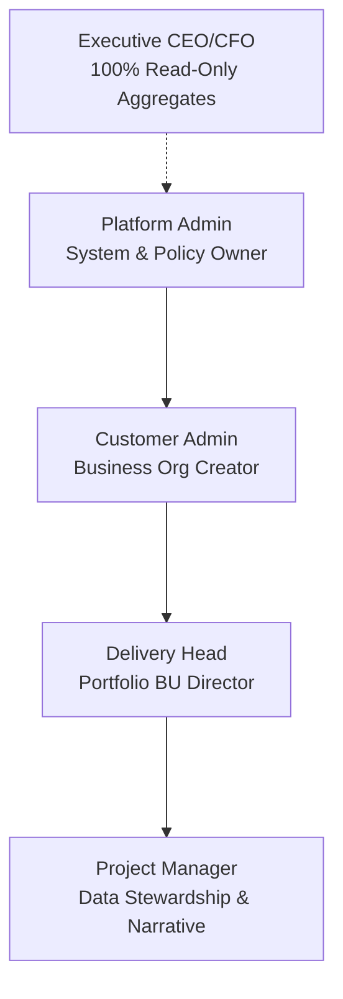
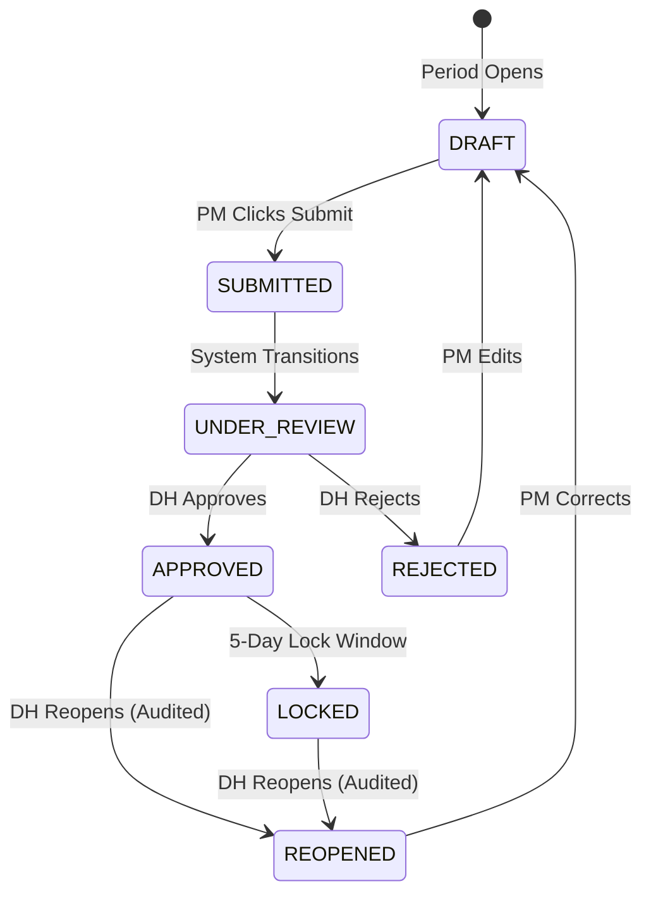

# DeliveryPulse AI — Glossary & Terminology Explanation

This document serves as the official, comprehensive dictionary of terms, roles, workflows, and metrics used throughout the **DeliveryPulse AI** platform. It provides clear, deep definitions and concrete examples to ensure alignment across all stakeholders, developers, and users.

---

## 1. Core Organizational Hierarchy

DeliveryPulse AI organizes its data model into a strict hierarchical taxonomy to represent the enterprise's corporate delivery structure.

| Entity | Definition | Example / Constraint |
| :--- | :--- | :--- |
| **Business Unit (BU)** | The highest level of division within the delivery organization, grouped by industry vertical, geographic region, or technology practice. | *Examples:* BFSI (Banking, Financial Services, and Insurance), Healthcare, Retail, Energy. |
| **Account** | A specific client, customer account, or organizational sponsor nested under a single Business Unit. An Account acts as a grouping container for one or more Projects. | *Examples:* Citibank (nested under BFSI), Pfizer (nested under Healthcare). |
| **Project** | An active, governed engagement delivering services or products, belonging to an Account. A Project is the level at which governance data is reported. | *Examples:* Core Banking Migration, Vaccine Portal Upgrade. |
| **Governance Period** | A standardized, cyclical time frame (typically calendar month or week) for which status metrics must be reported, analyzed, and locked. | *Example:* `2026-05` (May 2026 Monthly Period). |
| **Submission** | The transaction containing the 13 metric values, calculated health scores, narratives, and workflow status for a specific Project and Governance Period. | *Example:* Submission for Project *Core Banking Migration* in period *2026-05*. |

---

## 2. User Roles & Hierarchy

The system operates on a strict **Role-Based Access Control (RBAC)** model with segregated duties across five distinct roles.



### 2.1 Project Manager (PM)
* **Definition:** The day-to-day steward of project execution and delivery data.
* **Capabilities:** 
  * View assigned projects and metrics.
  * Enter metric values via manual forms or Excel uploads.
  * Save draft metrics, review live inline validation alerts, and add mandatory exception narratives for **RED** metrics.
  * Submit governance period reports for review.
* **Must NOT:** Create projects/accounts, assign other PMs, approve submissions, or change system thresholds.

### 2.2 Delivery Head (DH)
* **Definition:** The regional, practice, or portfolio lead responsible for delivery governance and risk management within a specific Business Unit.
* **Capabilities:** 
  * Complete oversight and portfolio review for their assigned BU.
  * Create Projects under accounts within their BU.
  * Assign PMs to projects.
  * Review, approve, reject, or reopen submissions.
* **Must NOT:** Create new Business Units or Accounts (owned by Customer Admin), edit raw metric values directly, or access data belonging to other BUs.

### 2.3 Customer Admin (CA)
* **Definition:** The company-wide business owner (e.g., Head of Delivery, COO, or Chief Delivery Officer).
* **Capabilities:** 
  * Customer-wide read-only visibility into all portfolios and projects.
  * Create new Business Units.
  * Create Accounts under Business Units.
  * Assign Delivery Heads to their respective Business Units (strict 1:1 mapping).
* **Must NOT:** Create projects, assign PMs, approve/reject submissions, or modify system metric thresholds.

### 2.4 Platform Admin
* **Definition:** The technical operator and system configurator representing the platform governance team.
* **Capabilities:** 
  * Global system configuration, master templates, and access parameters.
  * User account provisioning and global role assignment.
  * View audit logs, data lineage, and integration status.
  * Operational read-only visibility across all BUs.
* **Must NOT:** Approve standard PM submissions. Can edit metric values only in break-glass/support situations, which are fully audited.

### 2.5 Executive (CEO / CFO) — *Planned*
* **Definition:** A 100% read-only role designed for executive leadership.
* **Capabilities:** 
  * Access high-level enterprise and BU-aggregated health dashboards.
  * Drill down into any BU, Account, Project, or Timeline to inspect risk.
  * Review aggregated financial metric summaries (e.g., plan vs. actual budget burn).
* **Must NOT:** Perform any database write action, create entities, or alter workflows.

---

## 3. Submission Lifecycle & Workflow Steps

Submissions traverse a series of states representing review gates, verification, and permanent archiving.



### 3.1 DRAFT
* **Definition:** The workspace/sandbox state where the Project Manager compiles metrics for the reporting period.
* **Behavior:** Metrics are fully editable. PM can save changes repeatedly, upload Excel sheets, clear out values (partial saves), and resolve inline validation errors before submission.
* **Transition:** PM finalizes the data and submits, moving it to `SUBMITTED`.

### 3.2 SUBMITTED
* **Definition:** The PM has certified the data's accuracy and completed the entry cycle.
* **Behavior:** Modifying data is immediately locked for the PM. The backend processes the metrics and calculates the scores.
* **Transition:** Automatically moves to `UNDER_REVIEW`.

### 3.3 UNDER_REVIEW
* **Definition:** The submission has entered the queue of the assigned Delivery Head for portfolio analysis.
* **Behavior:** The Delivery Head reviews the scores, exception narratives, and historical trends. 
* **Transition:** The DH either clicks **Approve** (moving to `APPROVED`) or **Reject** (moving to `REJECTED`).

### 3.4 APPROVED
* **Definition:** The Delivery Head has reviewed the submission and accepted the metrics and narrative as realistic.
* **Behavior:** Marks the completion of the review cycle and logs the approval timestamp.
* **Transition:** Periodically transitions to `LOCKED` (e.g., after a configured lock offset, such as 5 days), or can be manually `REOPENED` by the DH if corrections are required.

### 3.5 REJECTED
* **Definition:** The Delivery Head rejects the submission due to incorrect data, missing narratives, or unaligned risk pictures.
* **Constraint:** **A rejection reason is strictly mandatory.**
* **Transition:** Moves back to `DRAFT`, unlocking the submission for the PM to correct.
* **Example:** *“QA Test Pass rate was entered as 95% but current test execution indicates 65%. Please verify and resubmit.”*

### 3.6 REOPENED
* **Definition:** An approved or locked submission is unlocked for corrections after the review window has passed.
* **Constraint:** **An audited reason is strictly mandatory.** The action creates a new audited version chain to preserve data integrity.
* **Transition:** Moves back to `DRAFT` so the PM can edit, and then follows the standard submission flow.
* **Example:** *“Client finance finalized month-end billing adjustments; budget metrics need to be updated to match the final invoiced amount.”*

### 3.7 LOCKED
* **Definition:** The permanent, immutable historical archive of a governance period.
* **Behavior:** The submission and all metric values are frozen. Standard editing is completely disabled. Reopening is restricted to Delivery Heads with a justified audit reason.

---

## 4. The 5 Governance Dimensions & 13 Metrics

DeliveryPulse AI enforces objective measurement across 5 distinct business dimensions. Each dimension has an individual score (0 to 100) calculated from its metrics.

### 4.1 Schedule Dimension (25% Weight)
Measures timeline execution and progress against the project baseline.
* **`planned_progress_percent`** (Decimal): The percentage of work expected to be completed according to the baseline schedule. *(E.g., 65.0%)*
* **`actual_progress_percent`** (Decimal): The actual percentage of work completed to date. *(E.g., 60.0%)*
* **`dependency_delay_count`** (Integer): The number of external, critical-path dependencies currently blocking or delaying progress. *(E.g., 2 delays)*

### 4.2 Quality Dimension (20% Weight)
Measures software release stability and engineering rigor.
* **`critical_defects`** (Integer): Number of open Priority 1 (P1) or blocker defects in issue trackers. *(E.g., 0)*
* **`test_pass_rate`** (Decimal): The percentage of passed test cases in the latest QA test execution cycle. Must be $\le 100$. *(E.g., 95.5%)*
* **`prod_incidents`** (Integer): Count of active, unresolved production incidents attributed to the project delivery. *(E.g., 1)*

### 4.3 Scope Dimension (15% Weight)
Measures requirements churn and alignment.
* **`scope_change_requests`** (Integer): Number of formal scope change requests submitted during the governance period. *(E.g., 3)*
* **`requirement_stability_percent`** (Decimal): Share of baseline requirements remaining unchanged. Must be $\le 100$. *(E.g., 98.0%)*

### 4.4 Finance Dimension (20% Weight)
Measures financial health and budget tracking.
* **`budget_used`** (Decimal): Cumulative actual spend recognized. *(E.g., $150,000)*
* **`planned_budget`** (Decimal): Approved budget envelope allocated for the period. *(E.g., $160,000)*
* **`billing_delay_days`** (Integer): Days elapsed between milestone completion and formal invoice dispatch. *(E.g., 12 days)*

### 4.5 People & Delivery Dimension (20% Weight)
Measures resource capacity and team stability.
* **`resource_availability`** (Decimal): Percentage of planned Full-Time Equivalent (FTE) capacity actively available for project work. *(E.g., 95.0%)*
* **`team_attrition`** (Integer): Count of voluntary/involuntary team departures during a rolling window. *(E.g., 1 departure)*

---

## 5. Scoring & Health Mechanics

The core engine of DeliveryPulse AI translates raw numeric metrics into color-coded status bands.

```text
Dimension Scores (Schedule, Quality, Scope, Finance, People)
               ↓ (Weighted Rollup Formula)
         Overall Health Score (0 - 100)
               ↓ (Threshold Classification)
         RAG Status Band (RED / AMBER / GREEN)
```

### 5.1 Dimension Score
* **Definition:** A normalized score from `0` to `100` calculated for each of the 5 governance dimensions using configured weights and sub-formulas.

### 5.2 Overall Health Score
* **Definition:** A consolidated score from `0` to `100` representing the project's absolute health.
* **Formula:**
  $$\text{Overall Health} = 0.25 \times \text{Schedule} + 0.20 \times \text{Quality} + 0.15 \times \text{Scope} + 0.20 \times \text{Finance} + 0.20 \times \text{People}$$

### 5.3 RAG Status Band
* **Definition:** The color-coded risk category assigned to a project based on its score. DeliveryPulse AI strictly supports a three-band classification:
  * **GREEN (80.0 to 100.0):** Project is healthy, on track, and meets all governance parameters.
  * **AMBER (50.0 to 79.9):** Project has minor risks or schedule/financial deviations that require monitoring.
  * **RED (0.0 to 49.9):** Project is at high risk, experiencing critical blockers, major budget overruns, or extreme quality drops.

### 5.4 Exception Narrative / Comment
* **Definition:** A mandatory text entry required from the PM whenever a metric falls into a **RED** threshold band. This narrative must explain the cause of the variance and the corrective action plan.

---

## 6. Audit, Timeline, & Excel Upload Flow

Concepts supporting data integrity, user feedback, and batch operations.

### 6.1 Submission Lifecycle Audit
* **Definition:** An append-only historical database record tracking every lifecycle change. It logs the actor, timestamp (UTC), prior state, new state, and change reason.

### 6.2 Compact Delta Auditing
* **Definition:** A specialized audit mechanism that identifies and records only the specific fields that changed between two saved drafts or submissions (e.g., `planned_progress_percent: 65.0 -> 80.0`), rather than saving redundant duplicates.

### 6.3 Risk Trigger
* **Definition:** Backend alert policies that generate in-app notifications whenever a submission's overall status changes to **RED** or when a Business Unit experiences a significant drop in average health.

### 6.4 Excel Batch Upload & Inline Preview Table
* **Definition:** A dual-mode update pipeline. The PM can download a pre-formatted Excel template, populate metrics offline, and drag-and-drop the file to upload.
* **Inline Grid Preview:** The frontend mounts a high-fidelity preview table showing the parsed Excel rows.
* **Real-time Client-Side Validation:** Editing any cell in the preview grid dynamically re-evaluates validation rules in real-time (e.g. throwing `Value must be <= 100` if the PM enters `809` for a rate).
* **Blank Cell Support:** If a PM leaves cells blank, the preview table strips out empty inputs before applying, seamlessly supporting partial draft saves and preventing database parsing failures.

---

> [!NOTE]
> All metrics and workflows outlined above are enforced consistently across both manual web forms and Excel batch uploads.
