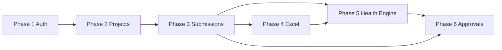

# DeliveryPulse AI — Backend Implementation Blueprint

**Version:** 1.0  
**Status:** Draft  
**Aligned with:** `PRODUCT_SPECIFICATION.md` v1.1 · `BACKEND_ARCHITECTURE.md` v1.0  
**Stack:** FastAPI · PostgreSQL · SQLAlchemy · Alembic · JWT · pandas · openpyxl  
**Last updated:** 2026-05-19  

---

## Document control

| Field | Value |
|-------|-------|
| Document type | Implementation blueprint — structure, boundaries, flows, build sequence |
| Out of scope | Full implementation code, React frontend, dashboards |

---

## Layered architecture

```
┌─────────────────────────────────────────────────────────────────────────┐
│  HTTP (FastAPI routers in app/api/)                                      │
├─────────────────────────────────────────────────────────────────────────┤
│  Middleware (auth, correlation, error handling)                          │
├─────────────────────────────────────────────────────────────────────────┤
│  Services (business logic, orchestration, transactions)                  │
├─────────────────────────────────────────────────────────────────────────┤
│  Domain modules (health_engine, excel, audit — specialized logic)        │
├─────────────────────────────────────────────────────────────────────────┤
│  Repositories (SQLAlchemy queries, persistence only)                     │
├─────────────────────────────────────────────────────────────────────────┤
│  Models (ORM entities)  ←→  PostgreSQL (Alembic migrations)              │
└─────────────────────────────────────────────────────────────────────────┘
```

**Dependency rule:** `api` → `services` → `repositories` → `models`. Domain modules (`health_engine`, `excel`, `audit`) are called **by** services, never by routers directly. Repositories never import services.

---

## Production folder structure

```text
backend/
├── alembic/                          # Alembic migration root (see database/)
├── app/
│   ├── __init__.py
│   ├── main.py                       # FastAPI app factory, lifespan, router mount
│   │
│   ├── api/                          # HTTP layer — thin controllers only
│   │   ├── __init__.py
│   │   ├── deps.py                   # Shared Depends: db session, current user
│   │   └── v1/
│   │       ├── __init__.py
│   │       ├── router.py             # Aggregates all v1 routers
│   │       ├── auth.py               # POST /login
│   │       ├── projects.py           # GET/POST /projects
│   │       ├── submissions.py        # POST/GET /submissions
│   │       ├── excel.py              # upload-template, parse-template
│   │       ├── approvals.py          # approve, reject, reopen
│   │       └── health.py             # GET /health-score
│   │
│   ├── core/                         # App-wide configuration and primitives
│   │   ├── __init__.py
│   │   ├── config.py                 # Settings (pydantic-settings): DB, JWT, storage
│   │   ├── security.py               # Password hash, JWT encode/decode helpers
│   │   ├── constants.py              # Role codes, status codes, dimension codes
│   │   ├── enums.py                  # Python enums mirroring DB lookups
│   │   ├── exceptions.py             # AppException hierarchy → HTTP mapping
│   │   └── logging.py                # Structured logging setup
│   │
│   ├── models/                       # SQLAlchemy ORM models (one module per aggregate)
│   │   ├── __init__.py               # Base, export all models for Alembic
│   │   ├── base.py                   # DeclarativeBase, TimestampMixin, SoftDeleteMixin
│   │   ├── role.py
│   │   ├── user.py
│   │   ├── organization.py           # business_unit, account
│   │   ├── project.py
│   │   ├── governance_period.py
│   │   ├── submission.py             # submission, submission_status, status_history
│   │   ├── metric.py                 # metric_definition, metric_value
│   │   ├── score.py                  # dimension_score, health_score
│   │   ├── approval.py
│   │   ├── audit.py
│   │   ├── excel_import.py
│   │   └── snapshot.py
│   │
│   ├── schemas/                      # Pydantic request/response DTOs (API contract)
│   │   ├── __init__.py
│   │   ├── auth.py
│   │   ├── project.py
│   │   ├── submission.py
│   │   ├── metric.py
│   │   ├── excel.py
│   │   ├── approval.py
│   │   ├── health.py
│   │   └── common.py                 # Pagination, error envelope, aging DTO
│   │
│   ├── repositories/                 # Data access — SQL only, no business rules
│   │   ├── __init__.py
│   │   ├── base.py                   # Generic CRUD, session helpers
│   │   ├── user_repository.py
│   │   ├── project_repository.py
│   │   ├── governance_period_repository.py
│   │   ├── submission_repository.py
│   │   ├── metric_repository.py
│   │   ├── score_repository.py
│   │   ├── approval_repository.py
│   │   ├── audit_repository.py
│   │   └── excel_import_repository.py
│   │
│   ├── services/                     # Business orchestration and transactions
│   │   ├── __init__.py
│   │   ├── auth_service.py
│   │   ├── project_service.py
│   │   ├── submission_service.py     # Draft, submit, lifecycle coordination
│   │   ├── metric_service.py         # Manual metric save, validation invoke
│   │   ├── approval_service.py       # Approve, reject, reopen
│   │   ├── lock_service.py           # Auto-lock scheduler logic
│   │   ├── aging_service.py          # Read-time aging calculations
│   │   └── access_control_service.py # Portfolio / project scope checks
│   │
│   ├── health_engine/                # Pure scoring domain (no HTTP, minimal DB)
│   │   ├── __init__.py
│   │   ├── engine.py                 # Orchestrates full compute pipeline
│   │   ├── metric_scorers/           # One scorer per metric (sub-score)
│   │   │   ├── __init__.py
│   │   │   ├── schedule.py
│   │   │   ├── quality.py
│   │   │   ├── scope.py
│   │   │   ├── finance.py
│   │   │   └── people.py
│   │   ├── dimension_aggregator.py
│   │   ├── health_aggregator.py
│   │   ├── rag_classifier.py
│   │   ├── escalation_rules.py     # Dimension cap, DH acknowledgment
│   │   ├── contracts.py              # Typed inputs/outputs (dataclasses)
│   │   └── ai_adapter.py             # Stub for future AI hooks
│   │
│   ├── excel/                        # Excel template and import domain
│   │   ├── __init__.py
│   │   ├── template_generator.py     # openpyxl: build downloadable template
│   │   ├── template_parser.py        # pandas: parse uploaded xlsx
│   │   ├── column_mapping.py         # metric_code ↔ excel column keys
│   │   ├── row_normalizer.py         # DataFrame → metric value dicts
│   │   ├── bulk_parser.py            # Future multi-project sheet support
│   │   └── contracts.py
│   │
│   ├── audit/                        # Audit emission and query helpers
│   │   ├── __init__.py
│   │   ├── auditor.py                # Central write API for audit_logs
│   │   ├── serializers.py            # old/new value serialization
│   │   ├── events.py                 # Event type constants
│   │   └── correlation.py            # correlation_id context var
│   │
│   ├── auth/                         # RBAC dependencies and policies
│   │   ├── __init__.py
│   │   ├── jwt_handler.py            # Token creation, validation, claims
│   │   ├── dependencies.py           # get_current_user, require_roles
│   │   ├── policies.py               # can_edit_submission, can_view_project
│   │   └── password.py               # Hash/verify wrappers (delegates to core.security)
│   │
│   ├── middleware/                   # ASGI / FastAPI middleware
│   │   ├── __init__.py
│   │   ├── correlation_middleware.py
│   │   ├── request_logging_middleware.py
│   │   └── exception_handler.py      # Maps AppException → JSON response
│   │
│   ├── utils/                        # Stateless helpers (no business logic)
│   │   ├── __init__.py
│   │   ├── datetime_utils.py         # UTC now, business days, aging
│   │   ├── decimal_utils.py
│   │   └── pagination.py
│   │
│   └── workers/                      # Background jobs (optional v1, structure ready)
│       ├── __init__.py
│       └── lock_scheduler.py         # APPROVED → LOCKED batch job
│
├── database/
│   ├── __init__.py
│   ├── session.py                    # Engine, SessionLocal, get_db dependency
│   ├── seeds/                        # Reference data SQL/scripts
│   │   ├── roles.sql
│   │   ├── submission_status.sql
│   │   └── metric_definitions.sql
│   └── alembic.ini                     # Or symlink: alembic/ at backend root
│
├── alembic/
│   ├── env.py                        # Imports app.models for autogenerate
│   ├── script.py.mako
│   └── versions/                     # Timestamped migration files
│
├── tests/
│   ├── __init__.py
│   ├── conftest.py                   # Test DB, client, fixtures
│   ├── unit/
│   │   ├── health_engine/
│   │   ├── excel/
│   │   ├── audit/
│   │   └── services/
│   ├── integration/
│   │   ├── api/
│   │   └── repositories/
│   └── fixtures/
│       ├── sample_governance.xlsx
│       └── seed_data.json
│
├── scripts/
│   ├── seed_db.py
│   └── run_lock_scheduler.py
│
├── .env.example
├── pyproject.toml                    # Dependencies, ruff, pytest
├── requirements.txt                  # Or poetry lock
├── Dockerfile
└── README.md
```

---

## Folder reference (purpose, files, boundaries)

### `backend/app/main.py`

| | |
|--|--|
| **Purpose** | Application entrypoint |
| **Files** | `main.py` |
| **Responsibility** | Create `FastAPI()` instance, register middleware, mount `api/v1/router`, configure lifespan (DB pool) |
| **Boundary** | No business logic |

---

### `backend/app/api/`

| | |
|--|--|
| **Purpose** | HTTP adapters — validate input via Pydantic schemas, call services, return responses |
| **Files** | `deps.py`, `v1/*.py` routers per resource |
| **Responsibility** | Route definitions, status codes, `Depends()` wiring |
| **Boundary** | **Must not** contain SQL, scoring formulas, or audit serialization. Max ~30 lines per handler after delegation. |

---

### `backend/app/core/`

| | |
|--|--|
| **Purpose** | Cross-cutting application configuration |
| **Files** | `config.py`, `security.py`, `constants.py`, `enums.py`, `exceptions.py`, `logging.py` |
| **Responsibility** | Environment settings, shared constants, exception base classes |
| **Boundary** | No database imports. No route definitions. |

---

### `backend/app/models/`

| | |
|--|--|
| **Purpose** | SQLAlchemy ORM mapping to PostgreSQL tables |
| **Files** | One file per aggregate; `base.py` for mixins |
| **Responsibility** | Table definitions, relationships, column types, `__tablename__` |
| **Boundary** | **No** business logic, validation rules, or API schemas. Alembic autogenerate imports from `models/__init__.py`. |

---

### `backend/app/schemas/`

| | |
|--|--|
| **Purpose** | Pydantic v2 models for API request/response contracts |
| **Files** | Mirror `api/v1` resources + `common.py` |
| **Responsibility** | Input validation, output shaping, OpenAPI documentation |
| **Boundary** | **No** database sessions. Separate from ORM models (never inherit SQLAlchemy models). |

---

### `backend/app/repositories/`

| | |
|--|--|
| **Purpose** | Persistence layer — encapsulate all SQLAlchemy queries |
| **Files** | `base.py` + one repository per aggregate |
| **Responsibility** | CRUD, filters, joins, optimistic locking where needed |
| **Boundary** | **No** JWT checks, scoring, Excel parsing, or status transition rules. Accept `Session`, return ORM objects or typed tuples. |

---

### `backend/app/services/`

| | |
|--|--|
| **Purpose** | Application / use-case layer — orchestrate repositories and domain modules |
| **Files** | `*_service.py` per bounded context |
| **Responsibility** | Transactions (`session.begin()`), call `health_engine`, `excel`, `audit`, enforce `access_control_service` |
| **Boundary** | **No** raw SQL (delegate to repositories). **No** FastAPI `Request` objects. |

---

### `backend/app/health_engine/`

| | |
|--|--|
| **Purpose** | Deterministic health scoring per product spec §4–§5 |
| **Files** | See PART 3 |
| **Responsibility** | Pure computation from metric inputs → scores and bands |
| **Boundary** | **No** FastAPI, **no** direct HTTP. Receives typed `contracts` input; returns scores. DB persistence done by `submission_service` via repositories. |

---

### `backend/app/excel/`

| | |
|--|--|
| **Purpose** | Template generation and file parsing (pandas + openpyxl) |
| **Files** | See PART 4 |
| **Responsibility** | Bytes ↔ DataFrame ↔ normalized metric dicts |
| **Boundary** | **No** submission status changes. **No** final submit. Parsing only; services own persistence. |

---

### `backend/app/audit/`

| | |
|--|--|
| **Purpose** | Centralized audit log emission |
| **Files** | See PART 5 |
| **Responsibility** | Serialize old/new values, write `audit_logs` via repository |
| **Boundary** | Called by services after successful mutations. Never blocks main flow on audit failure (log error + alert). |

---

### `backend/app/auth/`

| | |
|--|--|
| **Purpose** | Authentication and authorization for FastAPI dependencies |
| **Files** | `jwt_handler.py`, `dependencies.py`, `policies.py`, `password.py` |
| **Responsibility** | Login token issuance, `get_current_user`, `require_roles([...])`, resource-level policy checks |
| **Boundary** | Policies answer boolean “can X do Y?” — services call policies before mutations. |

---

### `backend/app/middleware/`

| | |
|--|--|
| **Purpose** | Cross-cutting HTTP concerns |
| **Files** | Correlation ID, logging, global exception handler |
| **Responsibility** | Attach `correlation_id` to context for audit; uniform error JSON |
| **Boundary** | No business rules |

---

### `backend/app/utils/`

| | |
|--|--|
| **Purpose** | Generic stateless helpers |
| **Files** | `datetime_utils.py`, `decimal_utils.py`, `pagination.py` |
| **Responsibility** | UTC time, business-day math, safe decimal rounding |
| **Boundary** | No DB, no domain-specific scoring |

---

### `backend/app/workers/`

| | |
|--|--|
| **Purpose** | Scheduled / background tasks |
| **Files** | `lock_scheduler.py` |
| **Responsibility** | `APPROVED` → `LOCKED` batch; invokes `lock_service` |
| **Boundary** | Invokes services with system user context; fully audited |

---

### `backend/database/` + `backend/alembic/`

| | |
|--|--|
| **Purpose** | Connection management and schema migrations |
| **Files** | `session.py`, `seeds/`, `alembic/versions/*.py` |
| **Responsibility** | Engine factory, `get_db` yield dependency, Alembic env targeting `app.models` |
| **Boundary** | Migrations are DDL only; seed scripts are idempotent reference data |

---

### `backend/tests/`

| | |
|--|--|
| **Purpose** | Automated verification |
| **Files** | `unit/` (health_engine, excel, pure logic), `integration/` (API + DB) |
| **Responsibility** | Phase-aligned test modules mirroring services |
| **Boundary** | Uses test database; never production credentials |

---

# PART 1 — Authentication design

## 1.1 Roles

| Code | Enum | Capabilities (summary) |
|------|------|------------------------|
| `PM` | `RoleCode.PM` | Assigned projects; draft/submit metrics; Excel import |
| `DELIVERY_HEAD` | `RoleCode.DELIVERY_HEAD` | Portfolio (BU) visibility; approve/reject/reopen |
| `PLATFORM_ADMIN` | `RoleCode.PLATFORM_ADMIN` | Master data; users; full audit read |

Stored in `roles` table; JWT carries `role_code` claim from `users.role_id`.

## 1.2 JWT flow

```text
┌──────────┐    POST /login     ┌──────────────┐    validate creds    ┌──────────────┐
│  Client  │ ─────────────────▶ │ auth.py      │ ────────────────────▶ │ auth_service │
└──────────┘                    │ (api)        │                       │ + user_repo  │
     ▲                          └──────────────┘                       └──────┬───────┘
     │                                  │                                    │
     │         { access_token, ... }    │                                    │
     └──────────────────────────────────┘                                    │
                                                                              ▼
                                                                    jwt_handler.create_token()
                                                                    claims: sub, email, role_code, exp
```

### Token structure (access token)

| Claim | Value |
|-------|-------|
| `sub` | `users.id` (UUID string) |
| `email` | User email |
| `role_code` | `PM` \| `DELIVERY_HEAD` \| `PLATFORM_ADMIN` |
| `exp` | UTC expiry (config: `ACCESS_TOKEN_EXPIRE_MINUTES`) |
| `iat` | Issued at |
| `type` | `access` |

Refresh tokens (optional v1.1): separate `type: refresh` with longer TTL; not required for v1 blueprint.

## 1.3 Login sequence

| Step | Component | Action |
|------|-----------|--------|
| 1 | `api/v1/auth.py` | Accept `LoginRequest` schema |
| 2 | `auth_service.authenticate(email, password)` | Load user by email; check `is_active`, `deleted_at` |
| 3 | `auth/password.py` | `verify_password(plain, user.password_hash)` |
| 4 | `jwt_handler.create_access_token(user)` | Sign HS256 (or RS256) with `SECRET_KEY` |
| 5 | `api` | Return `LoginResponse` with token + user summary |

Failed login: HTTP 401, generic message (no user enumeration).

## 1.4 Token validation (protected routes)

| Step | Component | Action |
|------|-----------|--------|
| 1 | `auth/dependencies.py` → `get_current_user` | Extract `Authorization: Bearer <token>` |
| 2 | `jwt_handler.decode_token` | Verify signature, expiry, `type == access` |
| 3 | `user_repository.get_by_id(sub)` | Load fresh user; reject if inactive/deleted |
| 4 | Inject `CurrentUser` dataclass | Available to all protected handlers via `Depends` |

Invalid/expired token: HTTP 401.

## 1.5 Role-based access

### Route-level (coarse)

```text
require_roles(RoleCode.PM)                    # submissions write, excel upload
require_roles(RoleCode.DELIVERY_HEAD)         # approve, reject, reopen
require_roles(RoleCode.PLATFORM_ADMIN)        # POST /projects, admin endpoints
require_roles(RoleCode.PM, RoleCode.DELIVERY_HEAD, ...)  # GET /projects
```

Implemented in `auth/dependencies.py` as `require_roles(*allowed)`.

### Resource-level (fine)

`access_control_service` enforces:

| Check | PM | Delivery Head | Platform Admin |
|-------|----|--------------|--------------------|
| `can_view_project(project_id)` | Assigned | BU of project | Always |
| `can_edit_submission(submission_id)` | Assigned + status allows edit | Never (default) | Never |
| `can_approve_submission(submission_id)` | Never | BU portfolio + `UNDER_REVIEW` | Never |
| `can_reopen_submission(submission_id)` | Never | BU portfolio + `APPROVED`/`LOCKED` | Never |

## 1.6 Protected vs public routes

| Route | Auth |
|-------|------|
| `POST /api/v1/login` | Public |
| `GET /health` (infra) | Public |
| All other `/api/v1/*` | `Depends(get_current_user)` |
| Role-specific mutations | Additional `Depends(require_roles(...))` |

## 1.7 Auth module file map

| File | Responsibility |
|------|----------------|
| `core/security.py` | Low-level JWT encode/decode, password hashing settings |
| `auth/jwt_handler.py` | Token builder/parser, claim validation |
| `auth/password.py` | bcrypt/argon2 verify wrapper |
| `auth/dependencies.py` | `get_current_user`, `require_roles` |
| `auth/policies.py` | Resource-level permission functions |
| `services/auth_service.py` | Login orchestration |
| `services/access_control_service.py` | Project/portfolio scope resolution |

---

# PART 2 — Submission architecture

## 2.1 End-to-end flows

### A. PM manual entry

```text
PM → POST /submissions { action: CREATE_DRAFT }
   → POST /submissions { action: SAVE_DRAFT, metrics: [...] }
   → POST /submissions { action: SUBMIT }
```

### B. PM Excel upload (converges to same pipeline)

```text
PM → GET  /templates/governance.xlsx     (template_generator)
   → POST /upload-template                (parse → STAGING)
   → PATCH preview metrics (optional)     (update STAGING via metric_service)
   → POST /parse-template { APPLY_TO_DRAFT }
   → POST /submissions { action: SAVE_DRAFT }  (optional, if further manual edits)
   → POST /submissions { action: SUBMIT }
```

### C. Delivery Head approval path

```text
DH → GET /submissions/{id}                 (review queue)
   → POST /approve  OR  POST /reject
   → (system) auto-lock scheduler → LOCKED + snapshot
```

### D. Reopen path

```text
DH → POST /reopen { reason }
   → submission_service: version++ , new DRAFT chain
   → PM edits → submit → approve → lock
```

## 2.2 Lifecycle state machine (service-owned)

```text
                    ┌─────────────┐
         ┌─────────│    DRAFT    │◀────────────────────────┐
         │         └──────┬──────┘                         │
         │                │ submit                          │
         │                ▼                                 │
         │         ┌─────────────┐                         │
         │         │  SUBMITTED  │                         │
         │         └──────┬──────┘                         │
         │                │ auto                          │
         │                ▼                                 │
         │         ┌─────────────┐    reject    ┌──────────┴──┐
         │         │UNDER_REVIEW │─────────────▶│  REJECTED   │
         │         └──────┬──────┘              └──────┬──────┘
         │           approve│reject                     │ auto
         │                ▼                            ▼
         │         ┌─────────────┐              (back to DRAFT)
         │         │  APPROVED   │
         │         └──────┬──────┘
         │                │ scheduler / policy
         │                ▼
         │         ┌─────────────┐
         │         │   LOCKED    │
         │         └──────┬──────┘
         │                │ reopen (DH)
         │                ▼
         │         ┌─────────────┐
         └─────────│  REOPENED   │──▶ DRAFT (new version)
                   └─────────────┘
```

**Owner:** `submission_service.transition_status(submission_id, to_status, actor, reason)`

Each transition:

1. Validates allowed edge (state machine table)
2. Updates `submissions.current_status_id`
3. Inserts `submission_status_history`
4. Sets date fields (`submission_date`, `approval_date`, `locked_at`)
5. Calls `audit.auditor.log_status_change(...)`

## 2.3 Operation matrix

| Operation | API | Service | Repository | Notes |
|-----------|-----|---------|------------|-------|
| Create draft | `submissions.py` | `submission_service.create_draft` | `submission_repository` | Status `DRAFT` |
| Save draft (manual) | `submissions.py` | `metric_service.save_committed_metrics` | `metric_repository` | `row_state=COMMITTED`, `source=MANUAL` |
| Upload Excel | `excel.py` | `submission_service` + `excel/template_parser` | `excel_import_repository`, `metric_repository` | `row_state=STAGING` |
| Preview edit | `excel.py` or `submissions.py` | `metric_service.save_staging_metrics` | `metric_repository` | STAGING only |
| Apply to draft | `excel.py` | `metric_service.apply_staging_to_committed` | `metric_repository` | Merge STAGING → COMMITTED |
| Submit | `submissions.py` | `submission_service.submit` | multiple | Validate → `health_engine` → persist scores → transition |
| Approve | `approvals.py` | `approval_service.approve` | `approval_repository`, `submission_repository` | |
| Reject | `approvals.py` | `approval_service.reject` | same | → `REJECTED` → `DRAFT` |
| Reopen | `approvals.py` | `approval_service.reopen` | `submission_repository` | Version chain |
| Lock | `workers/lock_scheduler` | `lock_service.lock_submission` | `snapshot_repository` | Immutable snapshot |

## 2.4 Submit pipeline (detailed)

```text
API (POST /submissions SUBMIT)
  │
  ▼
submission_service.submit(submission_id, user)
  │
  ├─▶ access_control_service.can_edit_submission()
  ├─▶ metric_service.validate_all_committed(submission_id)
  │     └─▶ metric validation rules from metric_definitions.validation_rules
  │
  ├─▶ health_engine.engine.compute(submission_metrics)
  │     ├─ metric_scorers → subscores
  │     ├─ dimension_aggregator → dimension scores
  │     ├─ health_aggregator → raw_score
  │     ├─ escalation_rules → capped_score
  │     └─ rag_classifier → band
  │
  ├─▶ score_repository.save_dimension_scores(...)
  ├─▶ score_repository.save_health_score(...)
  ├─▶ submission_service.update_rag_if_changed(...)
  │
  ├─▶ transition_status(SUBMITTED)
  ├─▶ transition_status(UNDER_REVIEW)    # automatic
  │
  └─▶ audit.auditor.log_submit(...)
```

## 2.5 Layer interaction diagram

```text
┌─────────────────────────────────────────────────────────────────┐
│                        API Router Layer                          │
│  submissions.py │ excel.py │ approvals.py │ health.py          │
└────────────────────────────┬────────────────────────────────────┘
                             │
                             ▼
┌─────────────────────────────────────────────────────────────────┐
│                       Service Layer                              │
│  submission_service │ metric_service │ approval_service          │
│  lock_service │ aging_service │ access_control_service           │
└─────┬──────────────────┬────────────────────┬───────────────────┘
      │                  │                    │
      ▼                  ▼                    ▼
┌──────────────┐  ┌──────────────┐    ┌──────────────┐
│ health_engine│  │    excel/    │    │    audit/    │
│   (pure)     │  │ pandas/xlsx  │    │  auditor     │
└──────────────┘  └──────────────┘    └──────────────┘
      │                  │                    │
      └──────────────────┼────────────────────┘
                         ▼
┌─────────────────────────────────────────────────────────────────┐
│                     Repository Layer                             │
│  submission_repo │ metric_repo │ score_repo │ approval_repo     │
└────────────────────────────┬────────────────────────────────────┘
                             ▼
┌─────────────────────────────────────────────────────────────────┐
│              SQLAlchemy Models → PostgreSQL                      │
└─────────────────────────────────────────────────────────────────┘
```

## 2.6 Transaction boundaries

| Use case | Transaction scope |
|----------|-------------------|
| Save draft metrics | Single transaction: upsert `metric_values` + audit each change |
| Apply Excel to draft | Batch upsert STAGING → COMMITTED + update import batch status |
| Submit | One transaction: scores + status transitions + RAG update + audit |
| Approve | One transaction: approval row + status + `approval_date` + audit |
| Lock | One transaction: snapshot JSON + status `LOCKED` + `locked_at` + audit |

---

# PART 3 — Health engine design

## 3.1 Module layout

```text
health_engine/
├── engine.py                 # Entry: compute(HealthComputeInput) → HealthComputeOutput
├── contracts.py              # Dataclasses: MetricInput, SubScoreResult, DimensionResult, HealthResult
├── metric_scorers/
│   ├── schedule.py           # planned/actual variance, dependency_delay_count
│   ├── quality.py            # critical_defects, test_pass_rate, prod_incidents
│   ├── scope.py              # scope_change_requests, requirement_stability_percent
│   ├── finance.py            # budget utilization, billing_delay_days
│   └── people.py             # resource_availability, team_attrition
├── dimension_aggregator.py   # Weighted dimension score from subscores
├── health_aggregator.py      # Weighted overall from dimension scores
├── rag_classifier.py         # score → GREEN | AMBER | RED (80/50 thresholds)
├── escalation_rules.py       # Dimension cap (any dim < 50 → cap 79)
└── ai_adapter.py             # Future: optional AI insight overlay
```

## 3.2 Responsibilities

| Component | Responsibility |
|-----------|----------------|
| **metric_scorers** | Map raw metric values → sub-score (0–100) per product spec tables |
| **dimension_aggregator** | Combine subscores with dimension weights (e.g. Schedule 40/35/25) |
| **health_aggregator** | Combine five dimension scores with overall weights (25/20/15/20/20) |
| **rag_classifier** | `band(score)`: ≥80 Green, ≥50 Amber, else Red |
| **escalation_rules** | Apply §5.4 cap; respect `dh_exception_acknowledged` flag |
| **engine** | Orchestrate pipeline; build `formula_snapshot` JSON for audit/AI |
| **ai_adapter** | v1: no-op stub returning `None`; v2: attach `ai_insight_summary` |

## 3.3 Compute pipeline

```text
HealthComputeInput
  metrics: dict[metric_code, Decimal]
  policy: DimensionWeights, DhAcknowledgedFlag
        │
        ▼
┌───────────────────┐
│  metric_scorers   │  → dict[metric_code, SubScoreResult(score, band)]
└─────────┬─────────┘
          ▼
┌───────────────────┐
│ dimension_agg     │  → dict[dimension_code, DimensionResult(score, band)]
└─────────┬─────────┘
          ▼
┌───────────────────┐
│ health_agg        │  → raw_score
└─────────┬─────────┘
          ▼
┌───────────────────┐
│ escalation_rules  │  → capped_score, dimension_cap_applied
└─────────┬─────────┘
          ▼
┌───────────────────┐
│ rag_classifier    │  → overall band
└─────────┬─────────┘
          ▼
HealthComputeOutput
```

## 3.4 Integration with services

| Caller | When | Persistence |
|--------|------|-------------|
| `submission_service.submit` | PM submit | `score_repository` writes `dimension_scores`, `health_scores` |
| `submission_service.preview_scores` (optional) | Draft save preview | No persist; return in API response only |
| `health.py` GET endpoint | Read latest | `score_repository.get_latest_by_submission` |

## 3.5 Future AI compatibility

| Extension point | Location | v1 behavior |
|-----------------|----------|-------------|
| `ai_adapter.enrich(result)` | After `engine.compute` | Returns input unchanged |
| `metric_values.ai_suggested_value` | DB column | Ignored by engine |
| `health_scores.ai_insight_summary` | DB column | NULL |
| `formula_snapshot` | `dimension_scores` JSONB | Store scorer inputs for replay / ML |

**Rule:** AI may **suggest** metric values (future `metric_service` path) but must not override computed scores without explicit policy flag.

---

# PART 4 — Excel architecture

## 4.1 Module layout

```text
excel/
├── template_generator.py     # openpyxl: build .xlsx from metric_definitions
├── template_parser.py        # pandas.read_excel → DataFrame
├── column_mapping.py         # Header row ↔ metric_code
├── row_normalizer.py         # DataFrame rows → list[ParsedMetricRow]
├── bulk_parser.py            # Multi-sheet / multi-project (future)
└── contracts.py              # ParsedMetricRow, ParseResult, ParseError
```

## 4.2 Flow: download template

```text
GET /api/v1/templates/governance.xlsx
  │
  ▼
excel/template_generator.build_template(project_id?, period_id?)
  │
  ├─ Load active metric_definitions (ordered by display_order)
  ├─ openpyxl: headers = excel_column_key, metadata sheet (project_code, period_label)
  └─ Return StreamingResponse (application/vnd.openxmlformats-officedocument.spreadsheetml.sheet)
```

**Files:** `api/v1/excel.py` (or `templates.py`), `excel/template_generator.py`  
**No database write.**

## 4.3 Flow: upload → parse → preview

```text
POST /upload-template (multipart file + submission_id)
  │
  ▼
submission_service.ensure_draft_editable(submission_id)
  │
  ▼
excel_import_repository.create_batch(file_metadata)
object_store.save(file)  → file_storage_key
  │
  ▼
excel/template_parser.parse(bytes) → DataFrame
excel/row_normalizer.normalize(df) → list[ParsedMetricRow]
  │
  ▼
metric_service.upsert_staging_metrics(submission_id, rows, batch_id)
  │   row_state = STAGING, source = EXCEL_IMPORT
  │
  ▼
metric_service.validate_staging(submission_id)  → validation_errors per row
  │
  ▼
audit.auditor.log_excel_parse(batch_id, ...)
  │
  ▼
Return ParsePreviewResponse (preview_metrics, parse_errors)
```

**Rule:** Submission status remains `DRAFT`. Never `SUBMITTED` from this endpoint.

## 4.4 Flow: edit preview

```text
PATCH /api/v1/submissions/{id}/staging-metrics  (or via parse-template VALIDATE)
  │
  ▼
metric_service.update_staging_metric(submission_id, metric_code, value)
  │
  └─ access_control + allows_editing check
```

PM edits individual STAGING rows before apply.

## 4.5 Flow: apply to draft → submit

```text
POST /parse-template { action: APPLY_TO_DRAFT }
  │
  ▼
metric_service.apply_staging_to_committed(submission_id, batch_id)
  │   DELETE/overwrite COMMITTED per metric_code from STAGING
  │   Set submission.data_entry_mode = EXCEL | MIXED
  │
  └─▶ audit log APPLY_TO_DRAFT

POST /submissions { action: SUBMIT }
  │
  └─▶ (standard submit pipeline — PART 2)
```

## 4.6 Validation layers

| Layer | When | Responsibility |
|-------|------|----------------|
| **Parse validation** | After pandas read | Required columns present, numeric coercion errors → `parse_errors` |
| **Schema validation** | Per row | `metric_definitions` datatype, min/max |
| **Business validation** | Apply + Submit | Cross-field rules (variance, budget ratio, red metric comments) |

Validation logic shared: `services/validation/metric_validator.py` (invoked by `metric_service`, not duplicated in excel/).

## 4.7 Future bulk upload

| Concern | Design |
|---------|--------|
| Template format | Additional sheet `Projects` with `project_code` column; metric sheets per project or wide format |
| Parser | `excel/bulk_parser.py` iterates sheets → `list[BulkProjectMetrics]` |
| Service | `submission_service.bulk_create_drafts()` — one draft per project/period |
| Transaction | Per-project sub-transactions; partial success report in response |
| API | `POST /api/v1/upload-template/bulk` (future) |

`bulk_parser.py` stub in v1; single-project path fully implemented first.

---

# PART 5 — Audit architecture

## 5.1 Module layout

```text
audit/
├── auditor.py          # Auditor.log(event: AuditEvent) → repository
├── serializers.py      # serialize_value(old), serialize_value(new)
├── events.py           # AuditAction enum, entity type constants
└── correlation.py      # contextvars: correlation_id from middleware
```

## 5.2 Required capture (per product spec)

| Field | Implementation |
|-------|----------------|
| **Who changed** | `changed_by_user_id` from `CurrentUser.id` (NULL for system worker) |
| **Old value** | `serializers.serialize(old_state)` → `audit_logs.old_value` |
| **New value** | `serializers.serialize(new_state)` → `audit_logs.new_value` |
| **Reason** | `reason` param on sensitive calls (reject, reopen, break-glass) |
| **Timestamp** | `created_at = utc_now()` set in repository (no `updated_at`) |
| **Affected entity** | `entity_type` + `entity_id` |

## 5.3 Auditor API (conceptual)

```text
auditor.log_metric_update(metric_value_id, field, old, new, user, correlation_id)
auditor.log_status_change(submission_id, from_status, to_status, user, reason)
auditor.log_approval(submission_id, decision, user, reason)
auditor.log_excel_parse(batch_id, status, user, metadata)
auditor.log_lock(submission_id, snapshot_id, locked_by_system=True)
```

## 5.4 Who calls auditor

| Service | Events |
|---------|--------|
| `metric_service` | Metric value create/update (committed and staging apply) |
| `submission_service` | Status transitions, submit |
| `approval_service` | Approve, reject, reopen |
| `lock_service` | Lock + snapshot creation |
| Excel upload handler | Parse batch created/failed |

## 5.5 Dual capture with status history

| Store | Purpose |
|-------|---------|
| `submission_status_history` | Ordered lifecycle, optimized for timeline queries |
| `audit_logs` | Compliance, cross-entity search, field-level detail |

Both written in same service transaction on status change.

## 5.6 Correlation

```text
Request → correlation_middleware sets contextvar
        → all auditor.log_* in that request share metadata.correlation_id
        → submit action ties metric updates + score compute + status change
```

## 5.7 Boundaries

| Do | Don't |
|----|-------|
| Append-only writes via `audit_repository` | Update/delete audit rows |
| Call from service layer after mutation | Call from repositories |
| Fail open with error log if audit insert fails | Roll back business transaction on audit failure (configurable; default: commit + alert) |

---

# PART 6 — Implementation order

## Phase overview

```text
Phase 1 ──▶ Phase 2 ──▶ Phase 3 ──▶ Phase 4 ──▶ Phase 5 ──▶ Phase 6
  Auth        Projects    Submissions    Excel       Health      Approvals
                                                      Engine
```

Each phase delivers testable vertical slices. Do not start a phase until the prior phase's foundation is merged.

---

## Phase 1 — Authentication

**Goal:** Secure API with JWT and role enforcement.

| Order | Deliverable |
|-------|-------------|
| 1.1 | `backend/` scaffold, `pyproject.toml`, `core/config.py`, `database/session.py` |
| 1.2 | Alembic init; migrations: `roles`, `users` |
| 1.3 | `models/role.py`, `models/user.py`; seed roles |
| 1.4 | `core/security.py`, `auth/jwt_handler.py`, `auth/password.py` |
| 1.5 | `repositories/user_repository.py`, `services/auth_service.py` |
| 1.6 | `schemas/auth.py`, `api/v1/auth.py` POST `/login` |
| 1.7 | `auth/dependencies.py` `get_current_user`, `require_roles` |
| 1.8 | `middleware/exception_handler.py`, `correlation_middleware.py` |
| 1.9 | Integration tests: login, invalid token, role guard on stub route |

**Exit criteria:** Authenticated requests work; unauthenticated return 401; role mismatch returns 403.

---

## Phase 2 — Projects

**Goal:** Organizational hierarchy and project visibility.

| Order | Deliverable |
|-------|-------------|
| 2.1 | Migrations: `business_units`, `accounts`, `projects`, `project_assignments` |
| 2.2 | ORM models + repositories |
| 2.3 | `services/access_control_service.py` (view rules) |
| 2.4 | `services/project_service.py` |
| 2.5 | `schemas/project.py`, `api/v1/projects.py` GET/POST |
| 2.6 | Seed sample BU/account/project + test users per role |
| 2.7 | Integration tests: PM sees assigned only; DH sees BU; Admin sees all |

**Exit criteria:** Project CRUD (admin) and scoped list (PM/DH) operational.

---

## Phase 3 — Submissions

**Goal:** Draft lifecycle, manual metrics, submit without Excel.

| Order | Deliverable |
|-------|-------------|
| 3.1 | Migrations: `governance_periods`, `submission_status`, `submissions`, `submission_status_history`, `metric_definitions`, `metric_values` |
| 3.2 | Seed `submission_status`, `metric_definitions` |
| 3.3 | Repositories: submission, metric, governance_period |
| 3.4 | `services/validation/metric_validator.py` |
| 3.5 | `services/metric_service.py` (manual COMMITTED save) |
| 3.6 | `services/submission_service.py` (create draft, save draft, state machine skeleton) |
| 3.7 | `audit/auditor.py` + `audit_repository` — metric + status events |
| 3.8 | `api/v1/submissions.py` CREATE_DRAFT, SAVE_DRAFT |
| 3.9 | Submit stub (transition only, no scores yet) OR wire health in Phase 5 before enabling SUBMIT |

**Exit criteria:** PM can open period, enter metrics manually, save draft; status transitions audited.

**Note:** Defer `SUBMIT` scoring to Phase 5; Phase 3 may implement submit as status-only behind feature flag.

---

## Phase 4 — Excel workflow

**Goal:** Template download, upload, staging preview, apply to draft.

| Order | Deliverable |
|-------|-------------|
| 4.1 | Migration: `excel_import_batches` |
| 4.2 | `excel/template_generator.py`, `column_mapping.py` |
| 4.3 | `excel/template_parser.py`, `row_normalizer.py` (pandas + openpyxl) |
| 4.4 | `excel_import_repository`, extend `metric_service` for STAGING |
| 4.5 | Local file storage adapter (configurable S3 later) |
| 4.6 | `api/v1/excel.py` upload-template, parse-template |
| 4.7 | GET template endpoint |
| 4.8 | Tests: fixture xlsx, parse errors, apply overwrites COMMITTED |
| 4.9 | `excel/bulk_parser.py` stub + contract tests for future shape |

**Exit criteria:** Excel path lands in STAGING; PM edits preview; apply merges to draft; still no auto-submit.

---

## Phase 5 — Health engine

**Goal:** Full scoring on submit; health read endpoint.

| Order | Deliverable |
|-------|-------------|
| 5.1 | Migrations: `dimension_scores`, `health_scores`, `rag_band_history` |
| 5.2 | `health_engine/contracts.py` + all `metric_scorers/*` |
| 5.3 | `dimension_aggregator`, `health_aggregator`, `rag_classifier`, `escalation_rules` |
| 5.4 | `health_engine/engine.py` + unit tests per metric table from product spec |
| 5.5 | `score_repository`, wire `submission_service.submit` → engine → persist |
| 5.6 | Update RAG on submission (`rag_start_date`, history table) |
| 5.7 | `api/v1/health.py` GET `/health-score` |
| 5.8 | `health_engine/ai_adapter.py` no-op stub |
| 5.9 | Enable `POST /submissions` SUBMIT end-to-end |

**Exit criteria:** Submit computes and stores scores; health endpoint returns latest; bands match spec thresholds.

---

## Phase 6 — Approvals

**Goal:** DH approve/reject/reopen; lock scheduler; immutable snapshots.

| Order | Deliverable |
|-------|-------------|
| 6.1 | Migrations: `approvals`, `submission_snapshots` |
| 6.2 | `approval_repository`, `services/approval_service.py` |
| 6.3 | `api/v1/approvals.py` approve, reject, reopen |
| 6.4 | `services/lock_service.py` + `workers/lock_scheduler.py` |
| 6.5 | Snapshot payload builder (metrics + scores JSON) |
| 6.6 | `services/aging_service.py`; expose aging on GET submission |
| 6.7 | Integration tests: full lifecycle DRAFT → LOCKED; reopen creates v2 |
| 6.8 | DH queue sort by `capped_score` |

**Exit criteria:** Full governance cycle per product spec; locked submissions immutable; audit complete.

---

## Post-v1 enhancements (not phased above)

| Item | Module |
|------|--------|
| Refresh tokens | `auth/jwt_handler.py` |
| S3 file storage | `core/config.py`, excel upload |
| Bulk Excel | `excel/bulk_parser.py` |
| AI suggestions | `health_engine/ai_adapter.py`, `metric_service` |
| Integration connectors | New `integrations/` package |
| OpenAPI export / API gateway | `main.py` |

---

## Cross-phase dependencies diagram



---

## Appendix — Key file checklist by phase

| Phase | New files (representative) |
|-------|---------------------------|
| 1 | `auth/*`, `api/v1/auth.py`, `services/auth_service.py` |
| 2 | `models/organization.py`, `api/v1/projects.py`, `services/project_service.py` |
| 3 | `models/submission.py`, `models/metric.py`, `services/submission_service.py`, `audit/*` |
| 4 | `excel/*`, `api/v1/excel.py`, `models/excel_import.py` |
| 5 | `health_engine/*`, `models/score.py`, `api/v1/health.py` |
| 6 | `api/v1/approvals.py`, `services/approval_service.py`, `workers/lock_scheduler.py` |

---

## Appendix — Alignment checklist

| Product / DB spec | Blueprint location |
|-------------------|-------------------|
| §3.2 Lifecycle | `submission_service` state machine |
| §3.3 Excel modes | `excel/`, `metric_service` STAGING/COMMITTED |
| §3.7 Dates | `utils/datetime_utils.py`, `aging_service` |
| §4 Metrics | `health_engine/metric_scorers/` |
| §5 Health | `health_engine/engine.py` |
| DB schema | `models/`, `alembic/versions/` |
| API contract | `api/v1/`, `schemas/` |

---

*End of implementation blueprint — DeliveryPulse AI v1.0*
