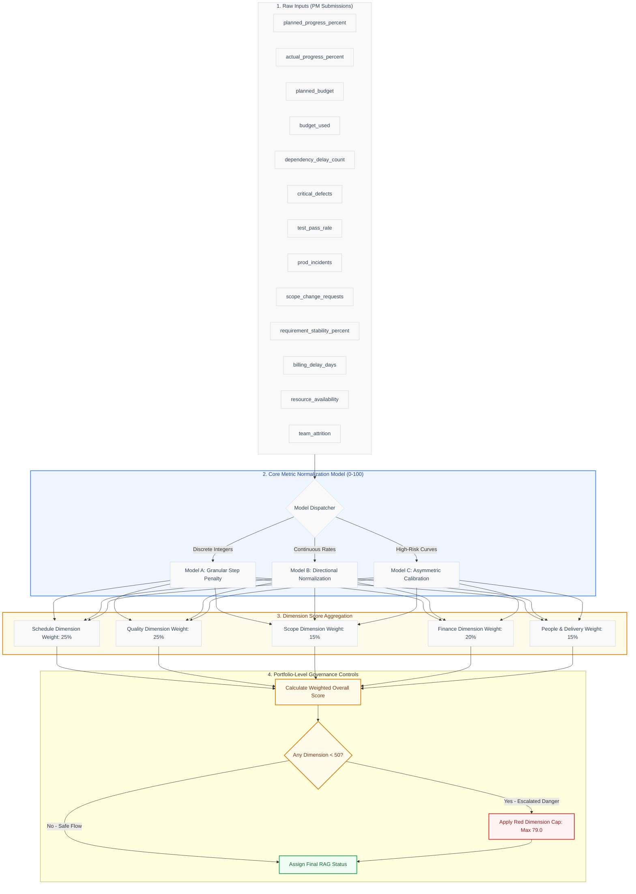

# DeliveryPulse AI — Operational Health Scoring Engine: Math, Thresholds, & Rationale Guide

This document serves as the master operational reference, mathematical specification, and governance blueprint for the **DeliveryPulse AI Health Scoring Engine**. It details exactly how raw project inputs are transformed into objective health statuses, the business rationales behind specific thresholds and coefficients, and step-by-step examples to ensure absolute transparency for senior executives, PMOs, and financial auditors.

---



---

## 1. Executive Summary & Core Design Philosophy

### The "Watermelon Greenwashing" Problem
In enterprise delivery, traditional project reporting suffers from **watermelon projects**—status indicators that show **Green** on the outside (often based on subjective PM claims or superficial indicators) but are bleeding **Red** on the inside (critical software instability, massive budget overruns, or major timeline slippage). PMs naturally experience cognitive biases, delaying difficult escalations in the hope that issues will resolve themselves before anyone notices.

### The DeliveryPulse AI Paradigm Shift
DeliveryPulse AI replaces subjective assessment with a **fully deterministic, database-driven, multidimensional health scoring engine**. 

This engine is governed by three fundamental principles:
1. **Absolute Objectivity:** PMs submit strictly factual operational telemetry (e.g., active defect counts, dollar expenditures, requirement stability rates). The system processes these inputs using standard mathematical models.
2. **Database-Configured Agility:** Metric definitions, target ranges, scoring models, and thresholds are retrieved directly from the database schema (`metric_definitions`). This removes hard-coded pricing or mathematical rules from the source code, allowing senior leadership to calibrate risk tolerances in real-time.
3. **Safety-Net Escalation Capping:** If a single critical operational category is failing, it cannot be masked by perfect scores in other dimensions. A strict portfolio-level cap instantly drops the overall health score into an attention-grabbing bracket.

---

## 2. Comprehensive Metric Configuration Registry

The database stores the parameter configurations for all **13 primary metrics**. These metrics are mapped to their respective governance dimensions, specifying exactly how they are processed.

| Metric Code | Metric Name | Dimension | Calculation Model | Direction | Target | Fail Limit | Weight inside Dimension | Step-Penalty Config (JSON Tiers) |
| :--- | :--- | :--- | :--- | :--- | :---: | :---: | :---: | :--- |
| `planned_progress_percent` | Planned Progress % | **Schedule** | *N/A* (Reference) | *N/A* | - | - | *0.00* | *Reference only* |
| `actual_progress_percent` | Actual Progress % | **Schedule** | `LINEAR_NORMALIZED` | `SCHEDULE_VARIANCE` | $0.0$ | $-15.0$ | **0.35** | *N/A* |
| `planned_vs_actual_progress` | Progress Alignment | **Schedule** | `AVERAGE` | `MORE_IS_BETTER` | - | - | **0.40** | *Arithmetic average of planned & actual progress* |
| `dependency_delay_count` | Dependency Delay Count | **Schedule** | `GRANULAR_STEP` | `LESS_IS_BETTER` | $0.0$ | $5.0$ | **0.25** | `[{"threshold": 0, "score": 100}, {"threshold": 2, "score": 70}, {"threshold": 5, "score": 40}, {"threshold": 6, "score": 10}]` |
| `critical_defects` | Critical Defects | **Quality** | `GRANULAR_STEP` | `LESS_IS_BETTER` | $0.0$ | $4.0$ | **0.40** | `[{"threshold": 0, "score": 100}, {"threshold": 1, "score": 75}, {"threshold": 2, "score": 50}, {"threshold": 3, "score": 25}, {"threshold": 4, "score": 0}]` |
| `test_pass_rate` | Test Pass Rate % | **Quality** | `LINEAR_NORMALIZED` | `MORE_IS_BETTER` | $95.0$ | $70.0$ | **0.35** | *N/A* |
| `prod_incidents` | Production Incidents | **Quality** | `GRANULAR_STEP` | `LESS_IS_BETTER` | $0.0$ | $4.0$ | **0.25** | `[{"threshold": 0, "score": 100}, {"threshold": 1, "score": 75}, {"threshold": 2, "score": 45}, {"threshold": 4, "score": 10}]` |
| `scope_change_requests` | Scope Change Requests | **Scope** | `GRANULAR_STEP` | `LESS_IS_BETTER` | $1.0$ | $6.0$ | **0.50** | `[{"threshold": 1, "score": 100}, {"threshold": 3, "score": 70}, {"threshold": 6, "score": 40}, {"threshold": 7, "score": 15}]` |
| `requirement_stability_percent`| Requirement Stability %| **Scope** | `LINEAR_NORMALIZED` | `MORE_IS_BETTER` | $90.0$ | $70.0$ | **0.50** | *N/A* |
| `planned_budget` | Planned Budget | **Finance** | *N/A* (Reference) | *N/A* | - | - | *0.00* | *Reference only (positive, > 0)* |
| `budget_used` | Budget Used (Utilization)| **Finance** | `LINEAR_NORMALIZED` | `ASYMMETRIC_BUDGET` | $100.0$ | $115.0$ | **0.50** | *N/A* |
| `billing_delay_days` | Billing Delay (days) | **Finance** | `LINEAR_NORMALIZED` | `LESS_IS_BETTER` | $7.0$ | $30.0$ | **0.50** | *N/A* |
| `resource_availability` | Resource Availability % | **People** | `LINEAR_NORMALIZED` | `MORE_IS_BETTER` | $90.0$ | $70.0$ | **0.55** | *N/A* |
| `team_attrition` | Team Attrition (12m) | **People** | `GRANULAR_STEP` | `LESS_IS_BETTER` | $0.0$ | $3.0$ | **0.45** | `[{"threshold": 0, "score": 100}, {"threshold": 1, "score": 80}, {"threshold": 2, "score": 50}, {"threshold": 3, "score": 20}]` |

---

## 3. Mathematical Calculations & Business Rationales

To aggregate operational metrics (measured in days, counts, percentages, and currencies), the engine maps all raw inputs onto a standardized, dimensionless scale of **$0.0$ to $100.0$** sub-scores. This is achieved via three distinct mathematical models.

---

### Model A: Granular Step-Penalty Tiers (`GRANULAR_STEP`)

Used primarily for discrete integer counts (e.g. defects, incident outages, resource attrition counts) where risks grow in step increments. 

#### Mathematical Formula
The engine parses the dynamic JSON configuration array from the database and returns the score associated with the first threshold bracket breached:
$$\text{Sub-score} = \text{Score associated with the first threshold } T_i \text{ breached by actual value } A$$

For `LESS_IS_BETTER` direction:
$$\text{Sub-score}(A) = \text{score of first } step_i \text{ where } A \le step_i[\text{"threshold"}]$$
If no step is matched (actual value exceeds the highest specified threshold), it defaults to the worst-case step score configured.

#### Detailed Business "Why"
* **Prevention of Information Loss:** Legacy systems used a coarse, binary Red/Amber/Green (100/50/15) model. This suffered from massive informational loss: having $1$ critical defect scored a $50$ (Amber), but having $3$ critical defects *also* scored a $50$ (Amber). This lacked nuance. 
* **Actionable Safety Zones:** Under this refined model, we offer a granular $5$-tier configuration ($100$/$75$/$50$/$25$/$0$). A PM with $1$ critical defect retains a score of $75$ (mild risk), whereas adding subsequent defects drops the score immediately to $50$ ($2$ defects), $25$ ($3$ defects), and finally $0$ ($4+$ defects), encouraging immediate remedial action.
* **The Worst-Case Score Floor (e.g. $10.0$ or $15.0$):** In certain configurations, the lowest score does not reach $0.0$ (e.g., Team Attrition floor is $20.0$, Billing Delays floor is $15.0$, Dependency Delay floor is $10.0$). This floor ensures the critical failure is registered at the metric level, while preventing a single metric from dropping a highly functional, healthy dimension score to absolute zero.

---

### Model B: Directional Min-Max Normalization (`LINEAR_NORMALIZED`)

Used for continuous variables (percentages, durations, days) to assess how far a value deviates from its targets.

#### 1. Directional Type: `MORE_IS_BETTER` (e.g. Test Pass Rate, Resource Availability)
* **Objective:** Value should remain as close to target as possible; higher is healthier.
* **Mathematical Formula:**
  $$\text{Sub-score} = \begin{cases} 
  100.0 & \text{if } A \ge T \\
  0.0 & \text{if } A \le F \\
  \left( 1 - \frac{T - A}{T - F} \right) \times 100 & \text{if } F < A < T
  \end{cases}$$
  Where $A$ is the actual submitted value, $T$ is the target value (e.g., $95.0\%$ test pass rate), and $F$ is the fail limit (e.g., $70.0\%$).

* **Detailed Business "Why":** Rather than penalizing a project with a steep cliff-edge if it drops slightly below target (e.g., scoring $94.5\%$ instead of $95.0\%$), this formula ensures a smooth, predictable, linear decay. This prevents false-alarm panic while accurately reflecting progressive quality degradation.

#### 2. Directional Type: `LESS_IS_BETTER` (e.g. Billing Delay Days)
* **Objective:** Value should remain as close to $0$ as possible; lower is healthier.
* **Mathematical Formula:**
  $$\text{Sub-score} = \begin{cases} 
  100.0 & \text{if } A \le T \\
  0.0 & \text{if } A \ge F \\
  \left( 1 - \frac{A - T}{F - T} \right) \times 100 & \text{if } T < A < F
  \end{cases}$$
  Where $T$ is the acceptable target threshold (e.g., $\le 7$ days of billing delay) and $F$ is the maximum fail limit (e.g., $\ge 30$ days delay).

* **Detailed Business "Why":** Under-budgeting or early milestone processing is safe, but delays represent working capital blockages. Linear degradation up to $30$ days reflects the mounting financial risk of invoice delays.

---

### Model C: High-Risk Curve Normalization (`LINEAR_NORMALIZED` with Asymmetry)

To handle financial and schedule variances, standard linear normalization is insufficient. These continuous metrics require custom asymmetric curves to match real-world risk dynamics.

#### 1. Asymmetric Budget Curve (`ASYMMETRIC_BUDGET`)
Cost management is highly asymmetric. Spending less than planned (under-spending) represents a minor risk (often due to timing shifts), whereas spending *more* than planned (overrunning budget) eats directly into gross margins, introducing extreme delivery risk.

* **Mathematical Formula:**
  The engine measures the budget utilization ratio:
  $$U = \left( \frac{\text{Budget Used}}{\text{Planned Budget}} \right) \times 100.0$$
  The sub-score is then calculated dynamically across three logical zones:
  $$\text{Sub-score}(U) = \begin{cases} 
  100.0 & \text{if } U \le 85.0\% \quad \text{(Safe Buffer Under-run)} \\
  100.0 - (U - 85.0) \times 1.0 & \text{if } 85.0\% < U \le 100.0\% \quad \text{(Standard Spend Zone)} \\
  \max(0.0, 85.0 - (U - 100.0) \times 4.0) & \text{if } U > 100.0\% \quad \text{(Cost Overrun Zone)}
  \end{cases}$$

```
   Scoring Curve
   100 |==================\
       |                  \
    85 |                   \
       |                    \
       |                     \
       |                      \
     0 +-----------------------+----> Budget Utilization (U%)
      0%                85%   100%   121.25%
```

* **Detailed Business Calibration Rationale:**
  * **$85\%$ Under-burn Buffer:** Projects do not spend money in a smooth linear line. Invoices arrive in cycles, and upfront expenses (licenses, hardware) skew early-phase burn rates. Allowing a project to burn up to $85\%$ of plan without any score penalty prevents false-alarm notifications.
  * **$\times 4.0$ Overrun Penalty Multiplier:** Once a project breaches $100\%$ spend, the risk increases exponentially. A $15\%$ cost overrun translates to a utilization ratio of $115\%$. Plugging this in:
    $$\text{Score} = 85.0 - (15 \times 4.0) = \mathbf{25.0} \quad \text{(RED financial alert)}$$
    This steep $\times 4.0$ multiplier ensures that a minor budget breach is escalated immediately to the Customer Admin and CFO before a project burns through its remaining reserves.

#### 2. Asymmetric Schedule Slippage Curve (`SCHEDULE_VARIANCE`)
Timeline variance is also asymmetric. Delivering ahead of schedule is a positive outcome, but accelerating too fast can indicate hasty work or over-allocation of resources. Slipping behind schedule, however, introduces severe contractual risks, SLA penalties, and delivery team burnout.

* **Mathematical Formula:**
  The engine measures the schedule variance ($V$):
  $$V = \text{Actual Progress \%} - \text{Planned Progress \%}$$
  The sub-score is calculated across two logical zones:
  $$\text{Sub-score}(V) = \begin{cases} 
  \min(100.0, 80.0 + (V \times 2.0)) & \text{if } V \ge 0.0\% \quad \text{(Ahead of Schedule Bonus)} \\
  \max(0.0, 80.0 - (|V| \times 4.0)) & \text{if } V < 0.0\% \quad \text{(Slipping Behind Schedule Penalty)}
  \end{cases}$$

* **Detailed Business Calibration Rationale:**
  * **The $80.0$ Baseline for On-Schedule Projects ($V = 0\%$):** Hitting a schedule plan perfectly is the baseline contractual standard. In project management terms, doing *exactly* what was planned is healthy (which is why it maps to the bottom boundary of the **GREEN** band, $80.0$), but it is not extraordinary. A perfect $100.0$ score is reserved for outstanding performance or timelines delivered ahead of schedule.
  * **$\times 2.0$ Ahead Bonus Multiplier:** If a team is ahead of schedule, they receive a mild bonus of $+2$ points per $1\%$ progress variance, capping at $100.0$ (achieved at $+10\%$ variance). This rewards timeline efficiency without encouraging teams to skip quality checks or burn out resources to achieve excessive progress ratios.
  * **$\times 4.0$ Slippage Penalty Multiplier:** Falling behind schedule is penalized aggressively. A $10\%$ schedule delay represents a massive delivery exception. Plugging $V = -10\%$ into the formula:
    $$\text{Score} = 80.0 - (|-10| \times 4.0) = \mathbf{40.0} \quad \text{(RED timeline alert)}$$
    By applying a heavy $\times 4.0$ penalty, any timeline delay exceeding $7.5\%$ immediately drops the schedule variance sub-score below $50.0$, pushing the overall status toward Amber/Red, which alerts the Delivery Head.

---

## 4. Dimension Aggregation & Weighing Architecture

Once the 13 individual metric sub-scores are calculated, the engine aggregates them into **five core dimensions** using localized weights.

```
+------------------------------------------------------------------------------------------------+
|                                    PROJECT OVERALL SCORE                                       |
+------------------------------------------------------------------------------------------------+
| Schedule (25%)  |  Quality (25%)  |    Scope (15%)    |   Finance (20%)   |  People & Del. (15%)  |
+-----------------+-----------------+-------------------+-------------------+-----------------------+
| - Alignment 40% | - Defects 40%   | - Scope Chg. 50%  | - Budget Util 50% | - Resource Avail 55%  |
| - Variance 35%  | - Pass Rate 35% | - Stability 50%   | - Bill Delay 50%  | - Attrition 45%       |
| - Blockers 25%  | - Outages 25%   |                   |                   |                       |
+-----------------+-----------------+-------------------+-------------------+-----------------------+
```

### 1. Schedule Dimension (Weight: 25.0%)
Measures planned vs. actual timeline execution.
$$\text{Schedule Score} = (0.40 \times \text{Progress Alignment}) + (0.35 \times \text{Schedule Variance}) + (0.25 \times \text{Dependency Delay Count})$$

### 2. Quality Dimension (Weight: 25.0%)
Measures codebase and software stability.
$$\text{Quality Score} = (0.40 \times \text{Critical Defects}) + (0.35 \times \text{Test Pass Rate}) + (0.25 \times \text{Production Incidents})$$

### 3. Scope Dimension (Weight: 15.0%)
Measures requirement volatility.
$$\text{Scope Score} = (0.50 \times \text{Scope Change Requests}) + (0.50 \times \text{Requirement Stability})$$

### 4. Finance Dimension (Weight: 20.0%)
Measures financial burn and billing cycles.
$$\text{Finance Score} = (0.50 \times \text{Budget Utilization}) + (0.50 \times \text{Billing Delay Days})$$

### 5. People & Delivery Dimension (Weight: 15.0%)
Measures team health and retention.
$$\text{People & Delivery Score} = (0.55 \times \text{Resource Availability}) + (0.45 \times \text{Team Attrition})$$

---

## 5. Red Dimension Cap Override (The Safety Net)

### The Overall Composite Score
The overall score is computed as a weighted average of the five dimensions:
$$\text{Standard Weighted Score} = \sum (\text{Dimension Score}_i \times \text{Dimension Weight}_i)$$
Where the sum of all weights equals $100\%$ ($25\% + 25\% + 15\% + 20\% + 15\%$).

### The Anti-Greenwashing Cap
To prevent a critical operational risk from being hidden by outstanding scores in other categories, the engine applies the **Red Dimension Cap Override**.

> [!IMPORTANT]
> **The Rule:** If any individual dimension score falls below **$50.0$** (which is the boundary for a **RED** dimension status), the overall project health score is subjected to a strict mathematical ceiling:
> $$\text{Final Capped Score} = \min(\text{Standard Weighted Score}, \text{RED\_DIMENSION\_CAP})$$
> Where $\text{RED\_DIMENSION\_CAP} = \mathbf{79.0}$ (the exact boundary separating GREEN and AMBER).

### Business Justification
Without this safety cap, a project with perfect finance ($100.0$), perfect scope ($100.0$), and perfect timeline execution ($100.0$), but a **Quality Score of $0.0$** (representing unstable code and major server outages) would score:
$$\text{Overall Score} = (100 \times 0.25) + (0 \times 0.25) + (100 \times 0.15) + (100 \times 0.20) + (100 \times 0.15) = \mathbf{75.0}$$
A score of **$75.0$** falls in the safe **AMBER** zone. An executive looking at a massive portfolio dashboard would see a moderately healthy project, completely unaware that the project's software is unusable. 

Applying the cap limits the score to $79.0$ and logs an explanation: *"Red dimension cap applied: Quality below 50; overall capped to 79.0"*. This warns the portfolio office of the underlying risk.

---

## 6. Comprehensive End-to-End Walkthrough Scenarios

Let's calculate three practical project scenarios to show how these formulas operate in real-world situations.

### RAG Classification Bands
* **GREEN:** $\ge 80.0$
* **AMBER:** $50.0 \le \text{Score} < 80.0$
* **RED:** $< 50.0$

---

### Scenario A: The "GREEN" Star Performer

This project represents outstanding execution, showing controlled spending, stable requirements, and on-time delivery.

#### Raw Telemetry Submissions
* **Schedule:** Planned = $70.0\%$, Actual = $72.0\%$ (Ahead!), Dependency Delays = $0$
* **Quality:** Critical Defects = $0$, Test Pass Rate = $98.0\%$, Production Incidents = $0$
* **Scope:** Scope Change Requests = $0$, Requirement Stability = $95.0\%$
* **Finance:** Planned Budget = \$100,000, Budget Used = \$80,000 (Under-budget!), Billing Delay = $5$ days
* **People:** Resource Availability = $95.0\%$, Team Attrition = $0$

#### Step 1: Metric Sub-score Normalization
1. **Schedule Variance:** Actual progress is ahead ($72\% - 70\% = +2\%$ variance).
   $$\text{Variance sub-score} = \min(100.0, 80.0 + (2 \times 2.0)) = \mathbf{84.00}$$
2. **Progress Alignment:** Arithmetic average of progress inputs.
   $$\text{Alignment sub-score} = \frac{70.0 + 72.0}{2} = \mathbf{71.00}$$
3. **Dependency Delay Count:** The value is $0$. Under `GRANULAR_STEP`, this matches threshold $0$.
   $$\text{Dependency sub-score} = \mathbf{100.00}$$
4. **Critical Defects:** The value is $0$. Under `GRANULAR_STEP`, this matches threshold $0$.
   $$\text{Defects sub-score} = \mathbf{100.00}$$
5. **Test Pass Rate:** The value is $98.0\%$. Under `MORE_IS_BETTER` (Target = $95.0\%$, Fail = $70.0\%$):
   Since actual ($98.0\%$) is greater than target ($95.0\%$), it scores **$100.00$**.
6. **Production Incidents:** The value is $0$. Under `GRANULAR_STEP`, this matches threshold $0$.
   $$\text{Incidents sub-score} = \mathbf{100.00}$$
7. **Scope Change Requests:** The value is $0$. Under `GRANULAR_STEP` (Threshold $\le 1$ scores $100$), it matches the top tier.
   $$\text{Scope Changes sub-score} = \mathbf{100.00}$$
8. **Requirement Stability:** The value is $95.0\%$. Under `MORE_IS_BETTER` (Target = $90.0\%$, Fail = $70.0\%$):
   Since actual ($95.0\%$) is greater than target ($90.0\%$), it scores **$100.00$**.
9. **Budget Utilization:** Spent \$80,000 of \$100,000 planned ($U = 80.0\%$). Under `ASYMMETRIC_BUDGET`:
   Since utilization ($80.0\%$) is less than the $85\%$ under-burn buffer:
   $$\text{Budget sub-score} = \mathbf{100.00}$$
10. **Billing Delay Days:** The value is $5$ days. Under `LESS_IS_BETTER` (Target = $7.0$, Fail = $30.0$):
    Since delay ($5$) is less than target ($7.0$), it scores **$100.00$**.
11. **Resource Availability:** The value is $95.0\%$. Under `MORE_IS_BETTER` (Target = $90.0\%$, Fail = $70.0\%$):
    Since actual ($95.0\%$) is greater than target ($90.0\%$), it scores **$100.00$**.
12. **Team Attrition:** The value is $0$. Under `GRANULAR_STEP`, this matches threshold $0$.
    $$\text{Attrition sub-score} = \mathbf{100.00}$$

#### Step 2: Dimension Aggregations
* **Schedule Dimension Score:**
  $$\text{Schedule} = (0.40 \times 71.00) + (0.35 \times 84.00) + (0.25 \times 100.00) = 28.40 + 29.40 + 25.00 = \mathbf{82.80} \quad \color{green}\text{[GREEN]}$$
* **Quality Dimension Score:**
  $$\text{Quality} = (0.40 \times 100.00) + (0.35 \times 100.00) + (0.25 \times 100.00) = \mathbf{100.00} \quad \color{green}\text{[GREEN]}$$
* **Scope Dimension Score:**
  $$\text{Scope} = (0.50 \times 100.00) + (0.50 \times 100.00) = \mathbf{100.00} \quad \color{green}\text{[GREEN]}$$
* **Finance Dimension Score:**
  $$\text{Finance} = (0.50 \times 100.00) + (0.50 \times 100.00) = \mathbf{100.00} \quad \color{green}\text{[GREEN]}$$
* **People & Delivery Score:**
  $$\text{People} = (0.55 \times 100.00) + (0.45 \times 100.00) = \mathbf{100.00} \quad \color{green}\text{[GREEN]}$$

#### Step 3: Overall Composite Score
* **Before-Cap Weighted Calculation:**
  $$\text{Score} = (82.80 \times 0.25) + (100.0 \times 0.25) + (100.0 \times 0.15) + (100.0 \times 0.20) + (100.0 \times 0.15)$$
  $$\text{Score} = 20.70 + 25.00 + 15.00 + 20.00 + 15.00 = \mathbf{95.70}$$
* **Red Dimension Check:** No dimension score is below $50.0$.
* **Final Health Score:** **$95.70$**
* **Portfolio Status:** **GREEN** (Outstanding execution)

---

### Scenario B: The "AMBER" Warning Project

This project shows moderate slippage: the team is running slightly behind schedule, has minor cost overruns, and has experienced a couple of quality issues.

#### Raw Telemetry Submissions
* **Schedule:** Planned = $60.0\%$, Actual = $54.0\%$ (Slipped $6\%$), Dependency Delays = $2$
* **Quality:** Critical Defects = $1$, Test Pass Rate = $90.0\%$, Production Incidents = $1$
* **Scope:** Scope Change Requests = $3$, Requirement Stability = $82.0\%$
* **Finance:** Planned Budget = \$100,000, Budget Used = \$92,000 (92% spend), Billing Delay = $12$ days
* **People:** Resource Availability = $85.0\%$, Team Attrition = $1$

#### Step 1: Metric Sub-score Normalization
1. **Schedule Variance:** Actual progress is behind ($54\% - 60\% = -6\%$ variance).
   $$\text{Variance sub-score} = \max(0.0, 80.0 - (6.0 \times 4.0)) = 80.0 - 24.0 = \mathbf{56.00}$$
2. **Progress Alignment:** 
   $$\text{Alignment sub-score} = \frac{60.0 + 54.0}{2} = \mathbf{57.00}$$
3. **Dependency Delay Count:** The value is $2$. Under `GRANULAR_STEP` JSON tiers:
   - Threshold $\le 0$ scores 100
   - Threshold $\le 2$ scores 70
   - Threshold $\le 5$ scores 40
   - Threshold $\le 6$ scores 10
   Actual value ($2$) matches the $\le 2$ tier. Score = **$70.00$**.
4. **Critical Defects:** The value is $1$. Under `GRANULAR_STEP` (Threshold $\le 1$ scores 75), it matches the second tier.
   $$\text{Defects sub-score} = \mathbf{75.00}$$
5. **Test Pass Rate:** The value is $90.0\%$. Under `MORE_IS_BETTER` (Target = $95.0\%$, Fail = $70.0\%$):
   $$\text{Pass Rate sub-score} = \left( 1 - \frac{95.0 - 90.0}{95.0 - 70.0} \right) \times 100 = \left( 1 - \frac{5.0}{25.0} \right) \times 100 = 0.8 \times 100 = \mathbf{80.00}$$
6. **Production Incidents:** The value is $1$. Under `GRANULAR_STEP` JSON tiers:
   - Threshold $\le 0$ scores 100
   - Threshold $\le 1$ scores 75
   - Threshold $\le 2$ scores 45
   - Threshold $\le 4$ scores 10
   Actual value ($1$) matches the $\le 1$ tier. Score = **$75.00$**.
7. **Scope Change Requests:** The value is $3$. Under `GRANULAR_STEP` JSON tiers:
   - Threshold $\le 1$ scores 100
   - Threshold $\le 3$ scores 70
   - Threshold $\le 6$ scores 40
   Actual value ($3$) matches the $\le 3$ tier. Score = **$70.00$**.
8. **Requirement Stability:** The value is $82.0\%$. Under `MORE_IS_BETTER` (Target = $90.0\%$, Fail = $70.0\%$):
   $$\text{Stability sub-score} = \left( 1 - \frac{90.0 - 82.0}{90.0 - 70.0} \right) \times 100 = \left( 1 - \frac{8.0}{20.0} \right) \times 100 = 0.6 \times 100 = \mathbf{60.00}$$
9. **Budget Utilization:** Spent \$92,000 of \$100,000 planned ($U = 92.0\%$). Under `ASYMMETRIC_BUDGET`:
   Since utilization ($92\%$) is within the standard spend zone ($85\% < U \le 100\%$):
   $$\text{Budget sub-score} = 100.0 - (92.0 - 85.0) \times 1.0 = 100.0 - 7.0 = \mathbf{93.00}$$
10. **Billing Delay Days:** The value is $12$ days. Under `LESS_IS_BETTER` (Target = $7.0$, Fail = $30.0$):
    $$\text{Billing sub-score} = \left( 1 - \frac{12.0 - 7.0}{30.0 - 7.0} \right) \times 100 = \left( 1 - \frac{5.0}{23.0} \right) \times 100 = (1 - 0.2174) \times 100 = \mathbf{78.26}$$
11. **Resource Availability:** The value is $85.0\%$. Under `MORE_IS_BETTER` (Target = $90.0\%$, Fail = $70.0\%$):
    $$\text{Resource sub-score} = \left( 1 - \frac{90.0 - 85.0}{90.0 - 70.0} \right) \times 100 = \left( 1 - \frac{5.0}{20.0} \right) \times 100 = 0.75 \times 100 = \mathbf{75.00}$$
12. **Team Attrition:** The value is $1$. Under `GRANULAR_STEP` JSON tiers:
    - Threshold $\le 0$ scores 100
    - Threshold $\le 1$ scores 80
    - Threshold $\le 2$ scores 50
    Actual value ($1$) matches the $\le 1$ tier. Score = **$80.00$**.

#### Step 2: Dimension Aggregations
* **Schedule Dimension Score:**
  $$\text{Schedule} = (0.40 \times 57.00) + (0.35 \times 56.00) + (0.25 \times 70.00) = 22.80 + 19.60 + 17.50 = \mathbf{59.90} \quad \color{orange}\text{[AMBER]}$$
* **Quality Dimension Score:**
  $$\text{Quality} = (0.40 \times 75.00) + (0.35 \times 80.00) + (0.25 \times 75.00) = 30.00 + 28.00 + 18.75 = \mathbf{76.75} \quad \color{orange}\text{[AMBER]}$$
* **Scope Dimension Score:**
  $$\text{Scope} = (0.50 \times 70.00) + (0.50 \times 60.00) = 35.00 + 30.00 = \mathbf{65.00} \quad \color{orange}\text{[AMBER]}$$
* **Finance Dimension Score:**
  $$\text{Finance} = (0.50 \times 93.00) + (0.50 \times 78.26) = 46.50 + 39.13 = \mathbf{85.63} \quad \color{green}\text{[GREEN]}$$
* **People & Delivery Score:**
  $$\text{People} = (0.55 \times 75.00) + (0.45 \times 80.00) = 41.25 + 36.00 = \mathbf{77.25} \quad \color{orange}\text{[AMBER]}$$

#### Step 3: Overall Composite Score
* **Before-Cap Weighted Calculation:**
  $$\text{Score} = (59.90 \times 0.25) + (76.75 \times 0.25) + (65.00 \times 0.15) + (85.63 \times 0.20) + (77.25 \times 0.15)$$
  $$\text{Score} = 14.975 + 19.1875 + 9.750 + 17.126 + 11.5875 = \mathbf{72.63}$$
* **Red Dimension Check:** No dimension score falls below the $50.0$ threshold (Schedule is closest at $59.90$).
* **Final Health Score:** **$72.63$** (Rounded)
* **Portfolio Status:** **AMBER** (Moderate execution risk, timeline monitoring recommended)

---

### Scenario C: The "RED" High-Risk Project (Failing Dimension Cap)

This project has excellent progress metrics, stable requirements, and spends exactly on plan. However, a major quality failure (numerous critical defects and multiple operational outages) introduces critical risk. We will see how the Red Dimension Cap prevents this risk from being masked.

#### Raw Telemetry Submissions
* **Schedule:** Planned = $80.0\%$, Actual = $80.0\%$ (Perfect timeline alignment), Dependency Delays = $0$
* **Quality:** Critical Defects = **$5$** (Quality breach!), Test Pass Rate = **$60.0\%$** (Failing), Production Incidents = **$4$** (Severe outages)
* **Scope:** Scope Change Requests = $0$, Requirement Stability = $98.0\%$
* **Finance:** Planned Budget = \$100,000, Budget Used = \$90,000 (90% spend), Billing Delay = $2$ days
* **People:** Resource Availability = $95.0\%$, Team Attrition = $0$

#### Step 1: Metric Sub-score Normalization
1. **Schedule Variance:** Actual progress is on schedule ($80\% - 80\% = 0\%$ variance).
   $$\text{Variance sub-score} = \mathbf{80.00}$$
2. **Progress Alignment:** 
   $$\text{Alignment sub-score} = \frac{80.0 + 80.0}{2} = \mathbf{80.00}$$
3. **Dependency Delay Count:** The value is $0$.
   $$\text{Dependency sub-score} = \mathbf{100.00}$$
4. **Critical Defects:** The value is $5$. Under `GRANULAR_STEP` JSON tiers:
   - Threshold $\le 4$ scores 0
   Actual value ($5$) exceeds the highest threshold. It defaults to the worst step score: **$0.00$**.
5. **Test Pass Rate:** The value is $60.0\%$. Under `MORE_IS_BETTER` (Target = $95.0\%$, Fail = $70.0\%$):
   Since actual ($60.0\%$) is strictly below the fail limit ($70.0\%$), it scores **$0.00$**.
6. **Production Incidents:** The value is $4$. Under `GRANULAR_STEP` JSON tiers:
   - Threshold $\le 4$ scores 10
   Actual value ($4$) matches the $\le 4$ tier. Score = **$10.00$**.
7. **Scope Change Requests:** The value is $0$. Under `GRANULAR_STEP` (Threshold $\le 1$ scores 100), it matches the top tier.
   $$\text{Scope Changes sub-score} = \mathbf{100.00}$$
8. **Requirement Stability:** The value is $98.0\%$. Under `MORE_IS_BETTER` (Target = $90.0\%$, Fail = $70.0\%$):
   Since actual ($98.0\%$) is greater than target ($90.0\%$), it scores **$100.00$**.
9. **Budget Utilization:** Spent \$90,000 of \$100,000 planned ($U = 90.0\%$). Under `ASYMMETRIC_BUDGET`:
   Since utilization ($90\%$) is within the standard spend zone ($85\% < U \le 100\%$):
   $$\text{Budget sub-score} = 100.0 - (90.0 - 85.0) \times 1.0 = 100.0 - 5.0 = \mathbf{95.00}$$
10. **Billing Delay Days:** The value is $2$ days. Since delay ($2$) is less than target ($7.0$), it scores **$100.00$**.
11. **Resource Availability:** The value is $95.0\%$. Since actual ($95.0\%$) is greater than target ($90.0\%$), it scores **$100.00$**.
12. **Team Attrition:** The value is $0$. Under `GRANULAR_STEP`, this matches threshold $0$.
    $$\text{Attrition sub-score} = \mathbf{100.00}$$

#### Step 2: Dimension Aggregations
* **Schedule Dimension Score:**
  $$\text{Schedule} = (0.40 \times 80.00) + (0.35 \times 80.00) + (0.25 \times 100.00) = 32.00 + 28.00 + 25.00 = \mathbf{85.00} \quad \color{green}\text{[GREEN]}$$
* **Scope Dimension Score:**
  $$\text{Scope} = (0.50 \times 100.00) + (0.50 \times 100.00) = \mathbf{100.00} \quad \color{green}\text{[GREEN]}$$
* **Finance Dimension Score:**
  $$\text{Finance} = (0.50 \times 95.00) + (0.50 \times 100.00) = 47.50 + 50.00 = \mathbf{97.50} \quad \color{green}\text{[GREEN]}$$
* **People & Delivery Score:**
  $$\text{People} = (0.55 \times 100.00) + (0.45 \times 100.00) = \mathbf{100.00} \quad \color{green}\text{[GREEN]}$$
* **Quality Dimension Score (The Failure):**
  $$\text{Quality} = (0.40 \times 0.00) + (0.35 \times 0.00) + (0.25 \times 10.00) = 0.00 + 0.00 + 2.50 = \mathbf{2.50} \quad \color{red}\text{[CRITICAL RED]}$$

#### Step 3: Overall Composite Score (Before Cap)
Calculating the weighted average without any overrides:
$$\text{Standard Weighted Score} = (85.00 \times 0.25) + (2.50 \times 0.25) + (100.00 \times 0.15) + (97.50 \times 0.20) + (100.00 \times 0.15)$$
$$\text{Standard Weighted Score} = 21.25 + 0.625 + 15.00 + 19.50 + 15.00 = \mathbf{71.38}$$

> [!NOTE]
> **Observation:** If the engine lacked a safety override, this project would report an overall health score of **$71.38$ (AMBER)**. Despite having critical outages, high defect counts, and failing test pass rates, the excellent progress and budget execution would mask the technical failure.

#### Step 4: Applying the Red Dimension Cap
1. The **Quality** dimension scored **$2.50$**, which is below the critical limit of $50.0$.
2. The safety cap triggers:
   $$\text{Final Capped Score} = \min(\text{Standard Weighted Score}, \text{RED\_DIMENSION\_CAP})$$
   $$\text{Final Capped Score} = \min(71.38, 79.00) = \mathbf{71.38}$$
3. While the score value remains $71.38$ because the weighted score was already below $79.0$, the presence of a **RED** dimension ($Quality < 50.0$) ensures the dimension is flagged, triggering notifications:
   * A high-priority escalation is logged: *"Red dimension cap applied: Quality below 50; overall score is capped."*
   * **RAG Classification:** Because the Quality dimension itself is strictly in **RED** (score $2.50$), it is logged as an active **RED** category, notifying the Customer Admins and Delivery Heads immediately of the high risk.
   * *If the Standard Weighted Score had been $86.5$ (as in the case of a slightly less severe quality drop like a $48.0$ Quality Score), the cap would have actively forced the score down from $86.5$ to $79.0$, converting the project's portfolio status from a misleading Green ($86.5$) to a warning Amber ($79.0$) to highlight the underlying risk.*

---

## 7. Operational FAQ (For Managers & PMOs)

**Q: Why does delivering a project exactly on time receive an 80% score instead of 100%?**  
A: Hitting the schedule plan perfectly is the baseline contractual expectation. An $80.0$ score indicates a healthy **GREEN** execution. To earn a perfect $100.0$, a team must deliver ahead of schedule, demonstrating timeline acceleration or early mitigation of dependency delay risks.

**Q: Why is budget overrun penalized so much more heavily ($\times 4.0$) than budget under-run?**  
A: Cost overruns eat directly into gross margins and indicate project mismanagement. Under-spending is often a timing variance and poses minimal risk, which is why we allow a safe $85\%$ spend buffer before applying a mild $-1.0$ penalty per $1\%$ under-run down to $100\%$ spend. Overrunning $100\%$ spend is treated as a severe financial exception.

**Q: How does the dynamic step scoring prevent "watermelon" reporting?**  
A: Instead of mapping defect counts to coarse Green/Amber/Red bands where large numbers of defects are grouped together, the dynamic step configuration maps each defect count to specific score drops ($100 \rightarrow 75 \rightarrow 50 \rightarrow 25 \rightarrow 0$). This ensures that every additional defect progressively degrades the Quality score, and once the Quality score drops below $50$, the Red Dimension Cap triggers, preventing other healthy metrics from masking the quality issues.
